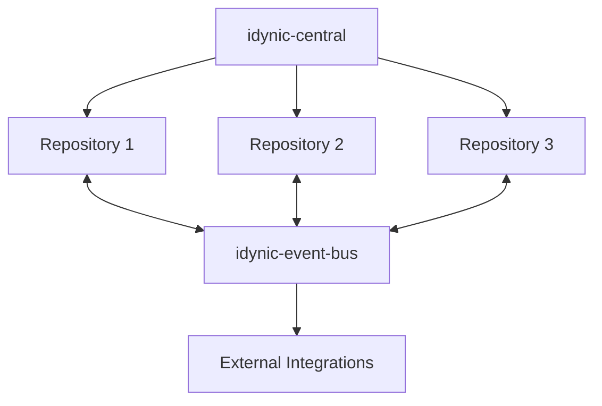
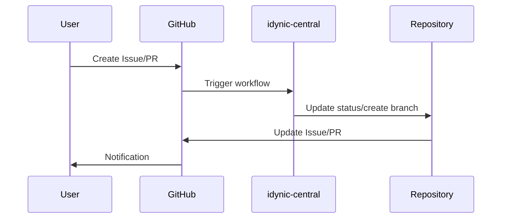
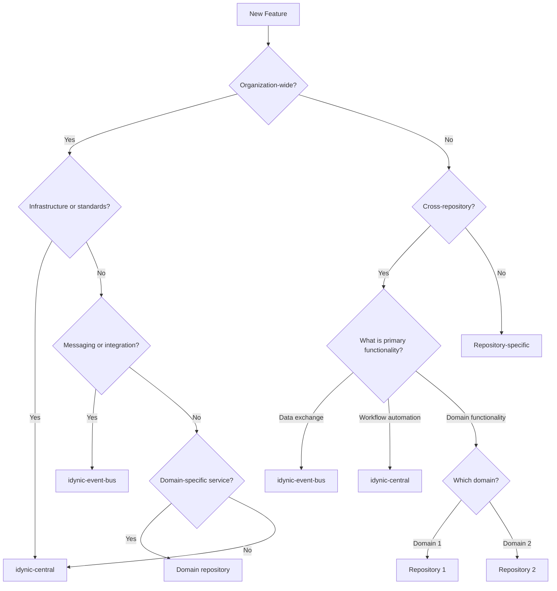
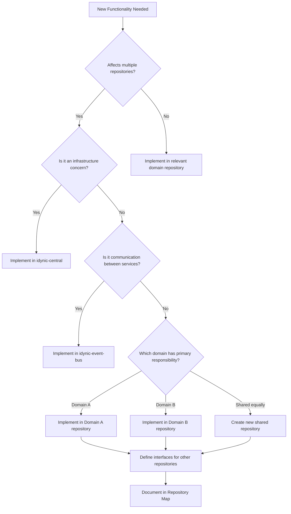

# Idynic Repository Map

> A comprehensive map of Idynic's repositories, documenting cross-repository relationships, boundaries, and decision guidelines.

## Table of Contents

- [System Overview](#system-overview)
  - [Repository Catalog](#repository-catalog)
  - [System Architecture](#system-architecture)
  - [Key Data Flows](#key-data-flows)
- [Boundary Definitions](#boundary-definitions)
  - [Ownership Boundaries](#ownership-boundaries)
  - [Interface Contracts](#interface-contracts)
  - [Shared vs. Owned Responsibilities](#shared-vs-owned-responsibilities)
- [Decision Framework](#decision-framework)
  - [Feature Placement Decision Tree](#feature-placement-decision-tree)
  - [Cross-Repository Feature Guidelines](#cross-repository-feature-guidelines)
  - [Boundary Dispute Resolution](#boundary-dispute-resolution)
- [Governance](#governance)
  - [Repository Boundary Updates](#repository-boundary-updates)
  - [Cross-Cutting Decision Authority](#cross-cutting-decision-authority)
  - [Change Impact Assessment](#change-impact-assessment)
- [Appendix](#appendix)
  - [Repository Responsibility Matrix](#repository-responsibility-matrix)
  - [Change History](#change-history)

## System Overview

The Idynic ecosystem consists of multiple repositories that work together to deliver a cohesive platform. This section provides a high-level overview of the system architecture, repositories, and their primary purposes.

### Repository Catalog

| Repository | Purpose | Key Responsibilities |
|------------|---------|---------------------|
| **idynic-central** | Central configurations and workflows | Configuration standards, CI/CD workflows, shared documentation templates |
| **idynic-event-bus** | Event messaging system | Reliable event delivery, message routing, pub/sub infrastructure |
| **[Additional repositories will be added as identified]** | | |

### System Architecture

The overall system architecture is illustrated below, showing the relationships between primary repositories and their place in the overall ecosystem.



*Note: This diagram will be updated as additional repositories are identified and documented.*

### Key Data Flows

This section illustrates the key data flows between repositories to provide visibility into how data moves through the system.

#### Workflow Data Flow



*Additional data flows will be documented as repositories and their interactions are identified.*

## Boundary Definitions

Clear boundary definitions are essential for distributed development. This section defines ownership boundaries, interfaces, and responsibilities across repositories.

### Ownership Boundaries

Each repository has specific ownership boundaries for data and functionality. These boundaries help determine where code, data, and functionality should reside.

| Repository | Data Ownership | Functional Ownership | Domain Ownership |
|------------|----------------|----------------------|------------------|
| **idynic-central** | Workflow configurations, Documentation templates, Standards definitions | CI/CD pipeline definitions, Organization standards, Cross-repository automation | Organization governance, Developer experience |
| **idynic-event-bus** | Event schemas, Message logs, Delivery metrics | Event publishing, Event subscription, Message routing | Inter-service communication, System integration |
| **[Additional repositories will be added as identified]** | | | |

#### Data Ownership Principles

1. **Single Source of Truth**: Each data entity should have a single authoritative source
2. **Local Storage for Local Use**: Data used only within a repository should be stored there
3. **Shared Data Through APIs**: When data is needed across repositories, access via well-defined APIs
4. **Derived Data is Temporary**: Repositories may cache derived data but must handle staleness

### Interface Contracts

Repositories interact through well-defined interfaces. These contracts establish expectations for communication between repositories and ensure reliable integration.

#### GitHub Actions Workflow Interfaces

- **Provider**: idynic-central
- **Consumers**: All repositories
- **Contract**:
  - Workflow files must maintain consistent input/output parameters
  - Breaking changes require version increments
  - Each repository references workflows via specific versions
- **Example**:
  ```yaml
  name: Issue Command Handler
  on:
    repository_dispatch:
      types: [issue_command]
  
  jobs:
    handle_command:
      uses: idynic/idynic-central/.github/workflows/issue-comment-commands.yml@v1
      with:
        command: ${{ github.event.client_payload.command }}
      secrets:
        project_token: ${{ secrets.PROJECT_TOKEN }}
  ```

#### Event Bus Interfaces

- **Provider**: idynic-event-bus
- **Consumers**: All service repositories
- **Contract**:
  - Events must conform to defined schemas
  - Publishers must not assume specific consumers
  - Consumers must be resilient to event format changes
  - Event versioning follows semantic versioning
- **Example**:
  ```javascript
  // Publishing an event
  eventBus.publish('user.created', {
    version: '1.0',
    data: {
      userId: '123',
      createdAt: new Date().toISOString()
    }
  });
  
  // Subscribing to an event
  eventBus.subscribe('user.created', event => {
    // Handle event
  });
  ```

*Additional interface contracts will be documented as repositories and their interactions are identified.*

### Shared vs. Owned Responsibilities

This section clarifies which responsibilities are shared across repositories versus those owned by specific repositories. Clear responsibility boundaries help prevent duplication and ensure consistency.

#### Shared Responsibilities

- **Documentation Standards**: All repositories follow documentation standards defined in idynic-central
- **CI/CD Practices**: All repositories follow CI/CD practices defined in idynic-central
- **Code Quality**: All repositories maintain code quality standards
- **Security Practices**: All repositories implement security best practices
- **Testing Strategy**: All repositories implement consistent testing approaches
- **Error Handling**: All repositories follow consistent error handling patterns

#### Repository-Specific Responsibilities

- **idynic-central**: 
  - Maintains workflow templates
  - Defines and updates documentation standards
  - Manages organization-wide configurations
  - Provides tools for cross-repository automation
  - Establishes governance processes

- **idynic-event-bus**:
  - Manages event schema registry
  - Handles reliable message delivery
  - Provides publisher and subscriber SDKs
  - Monitors message flow and system health
  - Enforces event schema compliance

- **[Additional repositories will be added as identified]**

#### Responsibility Assignment Matrix

For detailed responsibility assignments across repositories, see the [Repository Responsibility Matrix](#repository-responsibility-matrix) in the Appendix.

## Decision Framework

This section provides guidelines for determining where new features should be implemented and how cross-repository features should be handled. A clear decision framework reduces confusion, minimizes disputes, and ensures consistent architectural evolution.

### Feature Placement Decision Tree

The following decision tree helps determine where a new feature should be implemented. Start at the top and follow the path that matches your feature's characteristics.



#### Decision Questions

Answer these questions to help determine feature placement:

1. **Is this an organization-wide concern?**
   - Affects all/most repositories
   - Standardizes practices
   - Enforces governance

2. **Does it involve cross-repository communication?**
   - Facilitates data exchange
   - Requires coordinated deployments
   - Impacts multiple domains

3. **What is the primary domain?**
   - Where does most logic reside?
   - Who are the primary users?
   - Which team has the most expertise?

4. **Are there technical constraints?**
   - Language/framework dependencies
   - Infrastructure requirements
   - Performance considerations

### Cross-Repository Feature Guidelines

When implementing features that span multiple repositories, follow these guidelines to ensure smooth integration and maintainability.

#### Planning Phase

1. **Identify Primary Owner**: Determine which repository owns the core functionality
   - Consider domain alignment
   - Consider team expertise
   - Identify where most logic will reside

2. **Define Interfaces**: Clearly define the interfaces between repositories
   - Document data schemas
   - Specify API contracts
   - Identify event patterns
   - Version all interfaces

3. **Create Implementation Plan**:
   - Identify dependencies between repositories
   - Create linked issues in all affected repositories
   - Establish timeline with dependencies in mind
   - Document rollback procedures

#### Implementation Phase

4. **Coordinate Changes**:
   - Use linked issues in GitHub
   - Hold regular sync meetings with involved teams
   - Establish communication channel for the feature
   - Share progress updates across teams

5. **Sequence Deployments**:
   - Deploy changes in dependency order
   - Use feature flags for coordinated releases
   - Consider canary deployments for high-risk changes
   - Monitor for integration issues

6. **Test End-to-End**:
   - Ensure comprehensive testing across repository boundaries
   - Create integration test suites
   - Test failure scenarios and edge cases
   - Verify backward compatibility

#### Example: Cross-Repository Feature Implementation

**Feature**: Workflow notifications for issue status changes

* **Primary Owner**: `idynic-central` (owns workflow automation)
* **Involved Repositories**:
  * `idynic-central`: Workflow definitions
  * `idynic-event-bus`: Message delivery
  * `notification-service`: User notifications

* **Implementation Sequence**:
  1. Event schema definition in `idynic-event-bus`
  2. Workflow changes in `idynic-central`
  3. Notification handler in `notification-service`

### Boundary Dispute Resolution

When there is uncertainty or disagreement about where a feature belongs, follow this resolution process:

#### Resolution Process

1. **Initial Discussion**:
   - Repository owners discuss and attempt to reach consensus
   - Clearly document points of agreement and disagreement
   - Focus on architectural principles rather than team preferences

2. **Technical Analysis**:
   - Analyze coupling between components
   - Evaluate data ownership considerations
   - Consider deployment and operational impacts
   - Document findings and recommendations

3. **Escalation Path**:
   - If consensus cannot be reached, escalate to architecture review board
   - Schedule a dedicated review session
   - All involved parties present their perspectives
   - Architecture board makes final decision

4. **Decision Criteria**:
   - **Strategic alignment**: Aligns with long-term technical strategy
   - **Technical cohesion**: Logically fits with existing functionality
   - **Minimal coupling**: Reduces dependencies between repositories
   - **Team expertise**: Aligns with team ownership and knowledge
   - **Operational efficiency**: Simplifies deployment and monitoring
   - **User experience**: Provides the best developer/user experience

5. **Documentation**:
   - Document the final decision and rationale in the related issues
   - Update the Repository Map if boundaries change
   - Communicate decision to all stakeholders
   - Create a precedent for similar future decisions

#### Dispute Resolution Examples

**Example 1**: Authentication hooks in different services

* **Dispute**: Should authentication hooks live in each service or in a central auth service?
* **Resolution**: Authentication rules and verification in central auth service, with service-specific hooks in each repository for custom authorization logic
* **Rationale**: Centralized authentication for consistency and security, distributed authorization for flexibility and domain-specific rules

**Example 2**: Shared UI components

* **Dispute**: Should UI components be duplicated in each frontend repository or maintained in a shared component library?
* **Resolution**: Core components in shared library, specialized components in respective repositories
* **Rationale**: Balance between consistency (shared components) and domain-specific flexibility (specialized components)

## Governance

This section outlines how repository boundaries are managed and updated over time. Effective governance ensures that the repository ecosystem evolves in a controlled, predictable manner while allowing for innovation and adaptation.

### Repository Boundary Updates

The process for updating repository boundaries ensures that changes are well-considered, communicated, and implemented with minimal disruption.

#### Boundary Update Process

1. **Proposal**: 
   - Submit a proposal as an issue in idynic-central
   - Use the "Repository Boundary Change" issue template
   - Clearly state the current and proposed boundaries
   - Explain the rationale for the change

2. **Impact Analysis**: 
   - Analyze the impact on affected repositories
   - Document affected workflows and data flows
   - Identify affected teams and stakeholders
   - Estimate level of effort for implementation
   - Consider security and compliance implications

3. **Review**: 
   - Review by repository owners and architecture team
   - Conduct at least one formal review meeting
   - Document questions, concerns, and resolutions
   - Consider alternative approaches

4. **Approval**: 
   - Consensus or majority approval required
   - Record approvals in the issue comments
   - Document any dissenting opinions with rationale
   - Set expectations for implementation timeline

5. **Implementation**: 
   - Update this Repository Map and affected repositories
   - Create implementation plan with milestones
   - Update documentation across affected repositories
   - Adjust CI/CD pipelines as needed
   - Update monitoring and alerting configurations

6. **Communication**: 
   - Announce changes to all stakeholders
   - Provide training or guidance as needed
   - Update onboarding materials
   - Document lessons learned from the process

#### Boundary Update Example

**Change**: Moving logging standards from individual repositories to idynic-central

**Process**:
1. **Proposal**: Issue #123 "Centralize logging standards in idynic-central"
2. **Impact Analysis**: Affects all repositories, requires updates to CI/CD
3. **Review**: Architecture team and repository owners review and suggest modifications
4. **Approval**: Approved with 8/10 votes, with timeline adjusted based on feedback
5. **Implementation**: Updated Repository Map, created logging standards document, updated CI checks
6. **Communication**: Announcement in all-hands meeting, documentation updates, slack notification

### Cross-Cutting Decision Authority

Authority for decisions that impact multiple repositories is clearly defined to prevent uncertainty and ensure appropriate stakeholder involvement.

#### Decision Authority Matrix

| Decision Type | Authority | Approval Process | Documentation | Timeline |
|---------------|-----------|------------------|---------------|----------|
| Technical Standards | Architecture Team | RFC + Review | Standards Doc | 2-4 weeks |
| Organization Standards | Leadership Team | Proposal + Vote | Governance Doc | 2-4 weeks |
| Repository Boundaries | Repository Owners + Architecture Team | Consensus Required | Repository Map Update | 1-3 weeks |
| API Changes | Service Owners + Consumers | Contract Review | API Documentation | 1-2 weeks |
| Technology Selection | Architecture Team | POC + Review | Selection Document | 4-8 weeks |
| Emergency Changes | On-Call Team | Post-implementation Review | Incident Report | Immediate |

#### Decision Escalation Path

When decisions cannot be made at the designated level or when decisions are contested:

1. **Initial Level**: Team leads and repository owners
2. **First Escalation**: Architecture team
3. **Second Escalation**: CTO/VP Engineering
4. **Final Decision**: CEO (rare cases only)

Each escalation should include:
- Clear statement of the problem
- Options considered
- Recommendations
- Impact analysis of each option

### Change Impact Assessment

Guidelines for assessing the impact of changes across repositories help ensure appropriate levels of scrutiny, communication, and testing.

#### Impact Levels

- **Level 1**: Single repository, no interface changes
  - *Example*: Refactoring internal code, updating non-shared dependencies
  - *Risk*: Low

- **Level 2**: Single repository, interface changes
  - *Example*: Adding API endpoints, changing request/response format
  - *Risk*: Medium

- **Level 3**: Multiple repositories, compatible changes
  - *Example*: Adding shared functionality, extending existing interfaces
  - *Risk*: High

- **Level 4**: Multiple repositories, breaking changes
  - *Example*: Changing authentication mechanisms, major API version changes
  - *Risk*: Very High

#### Required Actions by Impact Level

| Impact Level | Notification | Documentation | Testing | Approvals | Deployment Strategy |
|--------------|--------------|---------------|---------|-----------|---------------------|
| Level 1 | Repository Team | Repository Docs | Unit/Integration | Team Lead | Standard |
| Level 2 | Dependent Teams | Interface Docs | Interface Tests | Team Lead | Staged |
| Level 3 | All Teams | System Docs | System Tests | All Affected Team Leads | Coordinated |
| Level 4 | All Teams + Management | Full System Docs | Full Regression | Architecture Team | Orchestrated |

#### Change Impact Assessment Process

For any significant change:

1. **Identify Impact Level**: Determine which level the change falls under
2. **Complete Impact Questionnaire**:
   - Which repositories are directly affected?
   - Which repositories are indirectly affected?
   - Are there API changes? Breaking or backward compatible?
   - Are there data schema changes?
   - Are there workflow changes?
   - Are there security implications?

3. **Create Change Plan**:
   - Communication strategy
   - Testing strategy
   - Rollout strategy
   - Rollback plan
   - Monitoring approach

4. **Obtain Required Approvals**:
   - Based on impact level
   - Document approvals in the change request

5. **Follow Through**:
   - Execute according to plan
   - Document any deviations
   - Conduct post-implementation review

### Repository Lifecycle Management

Guidelines for creating new repositories and retiring old ones ensure a well-maintained ecosystem.

#### Creating New Repositories

1. **Propose new repository**: Create issue in idynic-central
2. **Justify creation**: Document why existing repositories aren't suitable
3. **Define boundaries**: Clear ownership and interfaces
4. **Create repository**: Use standard template
5. **Update Repository Map**: Add to this document
6. **Establish governance**: Set up ownership and access controls

#### Repository Retirement Process

1. **Identify candidate**: Repositories with low activity or superseded functionality
2. **Assess impact**: Identify dependencies and users
3. **Create migration plan**: How functionality/data will be preserved
4. **Execute migration**: Move required functionality
5. **Archive repository**: Make read-only
6. **Update Repository Map**: Mark as archived
7. **Communicate**: Notify stakeholders of archive status

## Appendix

### Repository Responsibility Matrix

The following matrix summarizes the key responsibilities across repositories. This matrix helps clarify where specific functionality should reside and which repositories have authority over different aspects of the system.

#### Core Infrastructure & Standards

| Responsibility | idynic-central | idynic-event-bus | Service Repositories | UI Repositories |
|----------------|----------------|------------------|----------------------|-----------------|
| CI/CD Workflows | ✅ | ⚪ | ⚪ | ⚪ |
| Documentation Standards | ✅ | ⚪ | ⚪ | ⚪ |
| Code Quality Standards | ✅ | ⚪ | ⚪ | ⚪ |
| Deployment Automation | ✅ | ⚪ | ⚪ | ⚪ |
| Monitoring Framework | ✅ | ⚫ | ⚪ | ⚪ |
| Security Standards | ✅ | ⚪ | ⚪ | ⚪ |
| Testing Framework | ✅ | ⚪ | ⚪ | ⚪ |
| Development Environment | ✅ | ⚪ | ⚪ | ⚪ |

#### Communication & Integration

| Responsibility | idynic-central | idynic-event-bus | Service Repositories | UI Repositories |
|----------------|----------------|------------------|----------------------|-----------------|
| Event Definitions | ⚫ | ✅ | ⚪ | ⚪ |
| Message Delivery | ⚪ | ✅ | ⚪ | ⚪ |
| Authentication | ⚫ | ⚫ | ✅ | ⚪ |
| API Standards | ✅ | ⚫ | ⚪ | ⚪ |
| Service Discovery | ⚫ | ✅ | ⚪ | ⚪ |
| Circuit Breaking | ⚪ | ✅ | ⚫ | ⚪ |
| Rate Limiting | ⚪ | ✅ | ⚫ | ⚪ |

#### Data Management

| Responsibility | idynic-central | idynic-event-bus | Service Repositories | UI Repositories |
|----------------|----------------|------------------|----------------------|-----------------|
| Schema Definitions | ⚫ | ✅ | ⚫ | ⚪ |
| Data Validation | ⚪ | ✅ | ⚫ | ⚫ |
| Data Storage | ⚪ | ⚫ | ✅ | ⚪ |
| Data Migration | ⚪ | ⚪ | ✅ | ⚪ |
| Caching Strategy | ⚫ | ⚫ | ✅ | ⚫ |
| Data Access Patterns | ⚫ | ⚪ | ✅ | ⚪ |

#### User Interface

| Responsibility | idynic-central | idynic-event-bus | Service Repositories | UI Repositories |
|----------------|----------------|------------------|----------------------|-----------------|
| Component Library | ⚫ | ⚪ | ⚪ | ✅ |
| Design System | ⚫ | ⚪ | ⚪ | ✅ |
| Frontend Routing | ⚪ | ⚪ | ⚫ | ✅ |
| State Management | ⚪ | ⚫ | ⚫ | ✅ |
| UI Testing | ⚫ | ⚪ | ⚪ | ✅ |
| Accessibility | ⚫ | ⚪ | ⚪ | ✅ |

#### DevOps & Operations

| Responsibility | idynic-central | idynic-event-bus | Service Repositories | UI Repositories |
|----------------|----------------|------------------|----------------------|-----------------|
| Infrastructure as Code | ✅ | ⚫ | ⚫ | ⚫ |
| Alerting | ✅ | ⚫ | ⚫ | ⚫ |
| Incident Response | ✅ | ⚫ | ⚫ | ⚫ |
| Performance Monitoring | ✅ | ⚫ | ⚫ | ⚫ |
| Capacity Planning | ✅ | ⚫ | ⚫ | ⚫ |
| Disaster Recovery | ✅ | ⚫ | ⚫ | ⚫ |

Legend:
- ✅ Primary owner: Responsible for defining standards and implementation
- ⚫ Contributor: Provides input and may implement specific aspects
- ⚪ Consumer: Uses functionality but is not responsible for defining or implementing it

### Decision Flow Chart

The following flowchart provides a visual guide for determining where new functionality should be implemented.



### Change History

| Date | Version | Summary of Changes | Author |
|------|---------|-------------------|--------|
| 2025-05-20 | 0.1 | Initial draft of Repository Map | AI Assistant |

---

*This document is a living document and will be updated as the repository ecosystem evolves. Repository owners should review this document quarterly and propose updates as needed.*