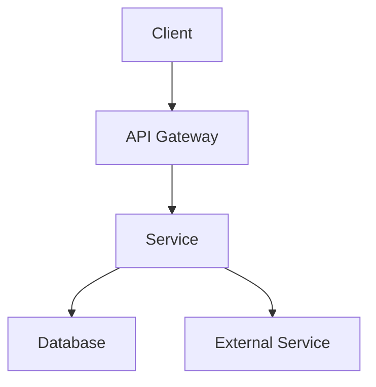
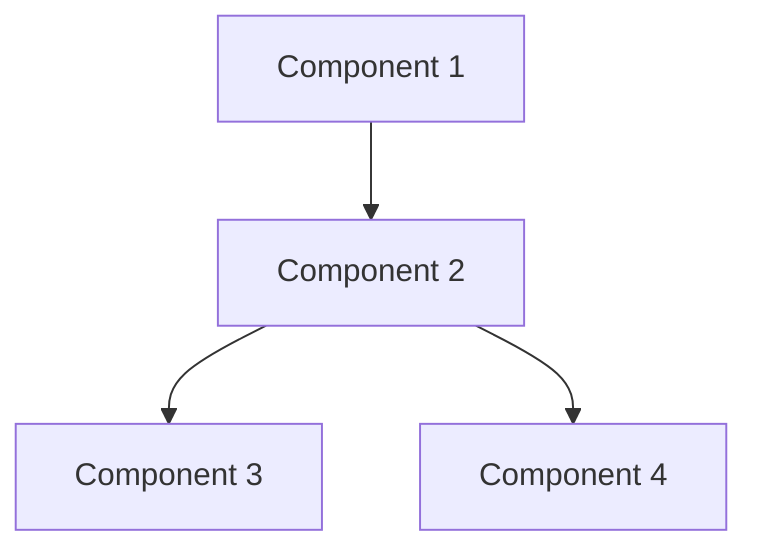
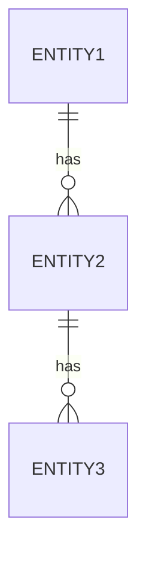
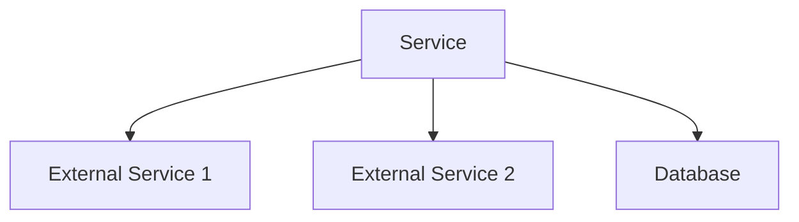
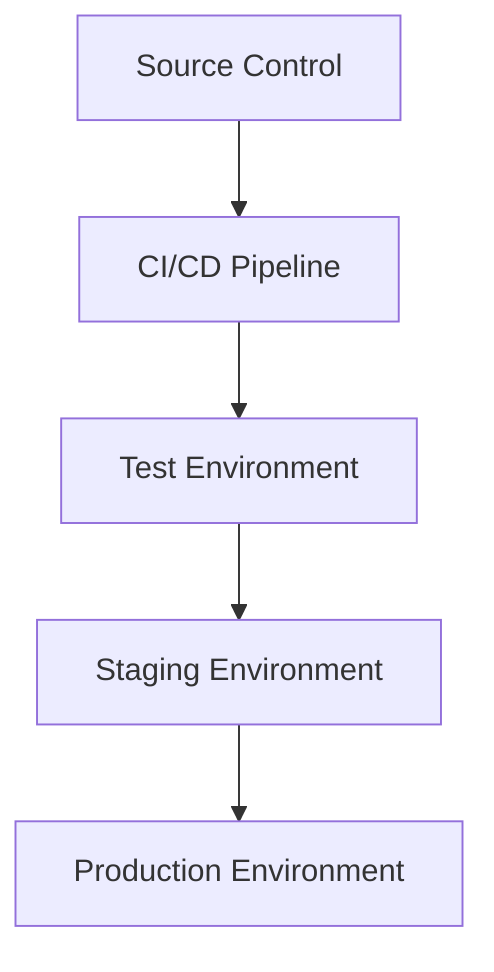

# [Service Name] Architecture

> This document describes the architecture of the [Service Name] service, including its components, data flow, and integration points.

## Table of Contents

- [System Overview](#system-overview)
- [Component Architecture](#component-architecture)
- [Data Architecture](#data-architecture)
- [Integration Architecture](#integration-architecture)
- [Deployment Architecture](#deployment-architecture)
- [Security Architecture](#security-architecture)
- [Scaling and Performance](#scaling-and-performance)
- [Monitoring and Observability](#monitoring-and-observability)
- [Failure Modes and Recovery](#failure-modes-and-recovery)
- [Future Considerations](#future-considerations)

## System Overview

### Purpose

[Describe the purpose and main responsibilities of this service]

### Key Features

- [Feature 1]
- [Feature 2]
- [Feature 3]

### Architecture Principles

- [Principle 1]
- [Principle 2]
- [Principle 3]

### High-Level Architecture Diagram

## Component Architecture

### Core Components

#### [Component 1]

- **Purpose**: [Description]
- **Responsibilities**:
  - [Responsibility 1]
  - [Responsibility 2]
- **Dependencies**:
  - [Dependency 1]
  - [Dependency 2]

#### [Component 2]

- **Purpose**: [Description]
- **Responsibilities**:
  - [Responsibility 1]
  - [Responsibility 2]
- **Dependencies**:
  - [Dependency 1]
  - [Dependency 2]

### Service Architecture Diagram

## Data Architecture

### Data Model

[Describe the high-level data model]

### Entity-Relationship Diagram

### Data Flow

1. [Step 1 in data flow]
2. [Step 2 in data flow]
3. [Step 3 in data flow]

### Data Storage

- **Primary Database**: [Database type and purpose]
- **Secondary Datastores**: [Other datastores and their purposes]
- **Caching Strategy**: [Caching approach]

### Data Integrity

[Describe how data integrity is maintained]

## Integration Architecture

### External Dependencies

#### [External Dependency 1]

- **Purpose**: [Description]
- **Integration Type**: [REST, GraphQL, Message Queue, etc.]
- **Data Exchanged**: [Description]
- **Failure Handling**: [Approach to handling failures]

#### [External Dependency 2]

- **Purpose**: [Description]
- **Integration Type**: [REST, GraphQL, Message Queue, etc.]
- **Data Exchanged**: [Description]
- **Failure Handling**: [Approach to handling failures]

### Integration Diagram

## Deployment Architecture

### Deployment Model

[Describe the deployment approach (e.g., containers, serverless, etc.)]

### Environment Strategy

- **Development**: [Description]
- **Testing**: [Description]
- **Staging**: [Description]
- **Production**: [Description]

### Infrastructure as Code

[Describe the IaC approach and tools]

### Deployment Pipeline

[Describe the CI/CD pipeline]

### Deployment Diagram

## Security Architecture

### Authentication and Authorization

[Describe the auth approach]

### Data Protection

[Describe how data is protected]

### Threat Model

[Summarize the key threats and mitigations]

### Compliance Considerations

[List relevant compliance requirements]

## Scaling and Performance

### Scaling Approach

[Describe vertical and horizontal scaling strategies]

### Performance Requirements

- **Throughput**: [Metrics]
- **Latency**: [Metrics]
- **Concurrency**: [Metrics]

### Resource Requirements

[Describe CPU, memory, storage, and network requirements]

### Performance Optimizations

[Describe key optimizations]

## Monitoring and Observability

### Metrics

[Key metrics collected]

### Logging

[Logging approach]

### Alerting

[Alerting strategy]

### Tracing

[Distributed tracing approach]

## Failure Modes and Recovery

### Common Failure Scenarios

#### [Failure Scenario 1]

- **Impact**: [Description]
- **Detection**: [How it's detected]
- **Mitigation**: [How it's mitigated]
- **Recovery**: [Recovery process]

#### [Failure Scenario 2]

- **Impact**: [Description]
- **Detection**: [How it's detected]
- **Mitigation**: [How it's mitigated]
- **Recovery**: [Recovery process]

### Resilience Patterns

[Describe circuit breakers, retries, timeouts, etc.]

### Disaster Recovery

[Approach to disaster recovery]

## Future Considerations

### Known Limitations

[List current limitations]

### Planned Improvements

[List planned architectural improvements]

### Technical Debt

[Summarize technical debt items]

## Appendix

### References

- [Reference 1]
- [Reference 2]

### Glossary

| Term | Definition |
|------|------------|
| Term 1 | Definition 1 |
| Term 2 | Definition 2 |