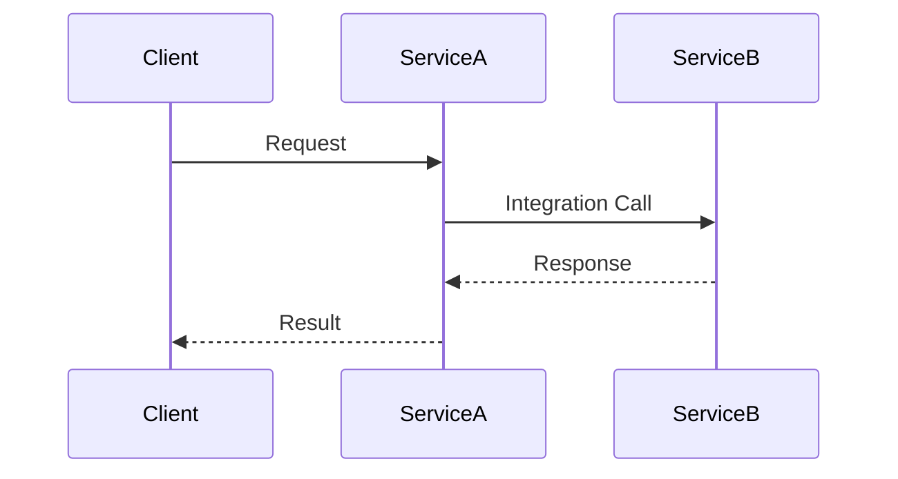

# [Service Name] Integration Guide

> This document provides guidance on integrating with [Service Name], including configuration, data exchange, and troubleshooting.

## Table of Contents

- [Overview](#overview)
- [Prerequisites](#prerequisites)
- [Integration Types](#integration-types)
- [Authentication](#authentication)
- [Configuration](#configuration)
- [Data Exchange](#data-exchange)
- [Error Handling](#error-handling)
- [Monitoring](#monitoring)
- [Examples](#examples)
- [Troubleshooting](#troubleshooting)
- [Support](#support)

## Overview

### Purpose

[Describe the purpose of this integration and what it enables]

### Integration Architecture

[High-level description of how the integration works]



### Key Features

- [Feature 1]
- [Feature 2]
- [Feature 3]

## Prerequisites

### Accounts and Access

- [Account/access requirement 1]
- [Account/access requirement 2]

### Technical Requirements

- [Technical requirement 1]
- [Technical requirement 2]

### Rate Limits

[Describe any rate limits that apply to this integration]

## Integration Types

### Type 1: [Name]

- **Description**: [Description]
- **Use Cases**: [Use cases]
- **Pros**: [Advantages]
- **Cons**: [Disadvantages]

### Type 2: [Name]

- **Description**: [Description]
- **Use Cases**: [Use cases]
- **Pros**: [Advantages]
- **Cons**: [Disadvantages]

## Authentication

### Method 1: [Name]

```
[Code or configuration example]
```

### Method 2: [Name]

```
[Code or configuration example]
```

## Configuration

### Environment Variables

| Variable | Description | Required | Default | Example |
|----------|-------------|----------|---------|---------|
| `VAR_1` | [Description] | Yes/No | [Default] | [Example] |
| `VAR_2` | [Description] | Yes/No | [Default] | [Example] |

### Configuration Files

#### Example [File Name]

```
[Configuration file example]
```

### Feature Flags

| Flag | Description | Default | Example |
|------|-------------|---------|---------|
| `FLAG_1` | [Description] | [Default] | [Example] |
| `FLAG_2` | [Description] | [Default] | [Example] |

## Data Exchange

### Data Formats

#### Format 1: [Name]

```
[Example of the data format]
```

#### Format 2: [Name]

```
[Example of the data format]
```

### Schema Definition

[Link to or embed schema definition]

### Data Mapping

| Source Field | Target Field | Transformation | Notes |
|--------------|--------------|----------------|-------|
| `field_1` | `field_a` | [Transformation] | [Notes] |
| `field_2` | `field_b` | [Transformation] | [Notes] |

## Error Handling

### Common Errors

| Error Code | Description | Resolution |
|------------|-------------|------------|
| `ERROR_1` | [Description] | [Resolution steps] |
| `ERROR_2` | [Description] | [Resolution steps] |

### Retry Strategy

[Describe recommended retry strategies]

```
[Code example of retry implementation]
```

### Circuit Breaking

[Describe circuit breaking pattern if applicable]

```
[Code example of circuit breaker]
```

### Fallback Mechanisms

[Describe fallback options when integration fails]

## Monitoring

### Health Checks

[Describe how to implement health checks]

```
[Code example of health check]
```

### Metrics

| Metric | Description | Type | Recommended Alert Threshold |
|--------|-------------|------|----------------------------|
| `metric_1` | [Description] | [Type] | [Threshold] |
| `metric_2` | [Description] | [Type] | [Threshold] |

### Logging

[Describe recommended logging approach]

```
[Code example of logging]
```

### Alerting

[Describe recommended alerting strategy]

## Examples

### Example 1: [Use Case]

```
[Code example for this use case]
```

### Example 2: [Use Case]

```
[Code example for this use case]
```

## Troubleshooting

### Issue 1: [Problem]

- **Symptoms**: [How to identify this issue]
- **Causes**: [Potential causes]
- **Resolution**: [Steps to resolve]

### Issue 2: [Problem]

- **Symptoms**: [How to identify this issue]
- **Causes**: [Potential causes]
- **Resolution**: [Steps to resolve]

## Support

### Documentation

- [Link to additional documentation 1]
- [Link to additional documentation 2]

### Contact Information

- **Technical Support**: [Contact information]
- **Integration Team**: [Contact information]
- **Status Page**: [Link to status page]

### Community Resources

- **Forums**: [Link to forums]
- **Stack Overflow**: [Link to relevant tags]
- **GitHub**: [Link to repositories]