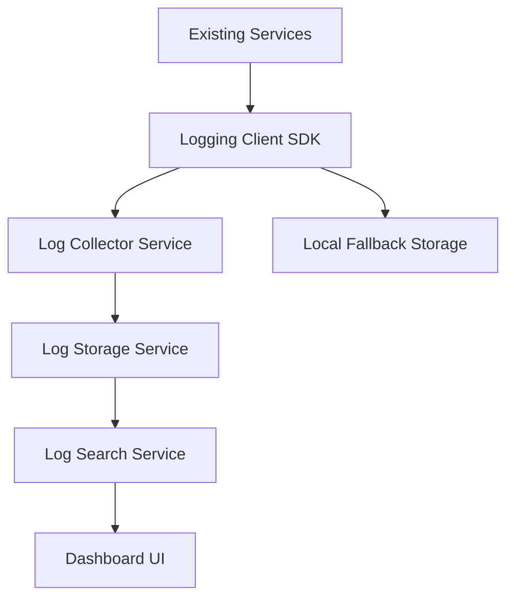
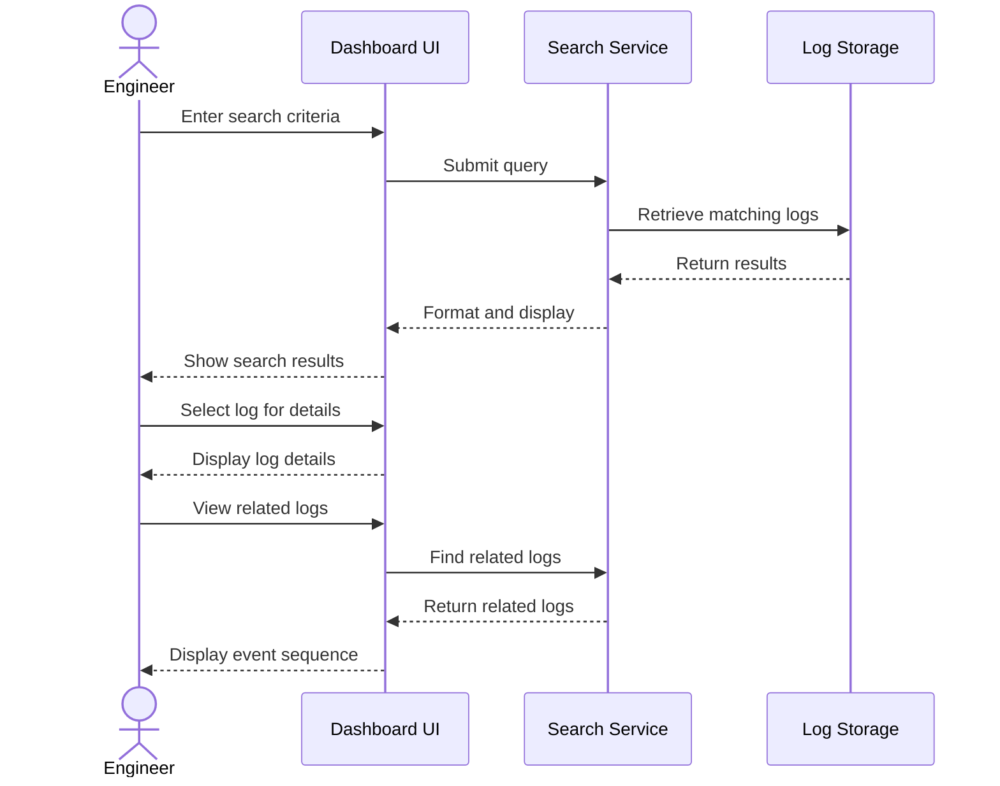
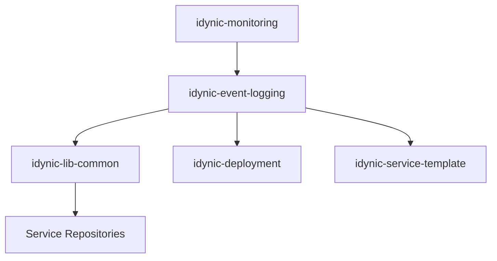

# Centralized Event Logging System Requirements Document

> This document outlines the requirements for the Centralized Event Logging System, including problem statement, proposed solution, implementation details, and acceptance criteria.

## Table of Contents

- [1. Problem Statement](#1-problem-statement)
- [2. Proposed Solution](#2-proposed-solution)
- [3. Repository Impact](#3-repository-impact)
- [4. Documentation Impact](#4-documentation-impact)
- [5. Implementation Details](#5-implementation-details)
- [6. Acceptance Criteria](#6-acceptance-criteria)
- [7. Timeline and Milestones](#7-timeline-and-milestones)
- [8. Appendix](#8-appendix)

## 1. Problem Statement

### Clear Problem Definition

Our microservice architecture currently lacks a standardized approach to event logging and monitoring across services. Each team implements their own logging solution, resulting in inconsistent formats, incomplete data, and difficulty tracking events across service boundaries. This makes debugging production issues time-consuming and error-prone, especially for issues that span multiple services.

### Current Limitations

- Limitation 1: **Inconsistent Log Formats** - Different services use different log formats, making it difficult to correlate events across services.
- Limitation 2: **Distributed Logs** - Logs are stored in different locations (local files, various cloud logging services), making it hard to get a complete picture of system behavior.
- Limitation 3: **Missing Context** - Many logs lack critical context like correlation IDs, making it impossible to trace requests across service boundaries.
- Limitation 4: **Manual Correlation** - Engineers spend an average of 4.5 hours per incident manually correlating logs from different services.
- Limitation 5: **Limited Search Capabilities** - Current logging solutions have limited search and filtering capabilities, increasing time to identify relevant logs.

### Success Metrics

| Metric | Current Value | Target Value | Measurement Method |
|--------|--------------|--------------|-------------------|
| Time to resolve cross-service incidents | 6.2 hours (avg) | < 3 hours (avg) | Incident resolution time in tracking system |
| Log correlation coverage | 35% of services | 100% of services | Percentage of services using correlation IDs |
| Log search time | 30 minutes (avg) | < 5 minutes (avg) | Time to find relevant logs (measured in user studies) |
| Cross-service trace completeness | 40% (estimated) | > 95% | Percentage of request flows with complete traces |
| Log standardization | 20% of services | 100% of services | Percentage of services using standard log format |

## 2. Proposed Solution

### High-Level Approach

We propose implementing a centralized event logging system that will collect, normalize, and store logs from all services. The system will provide a unified API for logging and a central dashboard for searching and analyzing logs. All services will be updated to use a standard logging client that automatically includes contextual information like correlation IDs.

This approach was chosen over alternative solutions (such as distributed tracing only or improved local logging) because it provides both immediate operational benefits while laying the groundwork for more advanced observability features in the future.

### Key Components and Interactions

#### Component Descriptions

| Component | Purpose | Key Functionality |
|-----------|---------|------------------|
| Logging Client SDK | Standardize log creation across services | Automatic context injection, consistent formatting, fallback mechanisms |
| Log Collector Service | Collect and process logs from all services | Receiving logs, validation, batching, forwarding |
| Log Storage Service | Store logs durably and efficiently | Log persistence, indexing, retention policies |
| Log Search Service | Enable efficient searching of logs | Full-text search, filtering, aggregation |
| Dashboard UI | Provide user interface for log analysis | Visualization, query builder, saved searches |

### User Experience Considerations

#### User Workflow

#### UI/UX Considerations

The dashboard UI will prioritize fast search and filtering capabilities, with intuitive visualization of log sequences. Key features include:

- Query builder with auto-suggestion based on available fields
- Timeline visualization of related events
- One-click navigation between related logs
- Saved searches and alerts
- Service topology view showing message flow

A preliminary wireframe for the main dashboard is available in the design repository at `design-system/mockups/logging-dashboard.fig`.

## 3. Repository Impact

### Primary Repository for Implementation

**Repository**: `idynic-event-logging`

- **Purpose**: New repository for the core logging system components
- **Key Areas for Changes**:
  - `logging-client`: Client SDK for services to use
  - `log-collector`: Service for collecting and processing logs
  - `log-storage`: Service for storing and indexing logs
  - `log-search`: Service for searching and retrieving logs
  - `dashboard-ui`: User interface for log analysis

### Secondary Repositories Requiring Changes

| Repository | Purpose | Required Changes | Impact Level |
|------------|---------|------------------|-------------|
| `idynic-service-template` | Template for new services | Add logging client as standard dependency, update documentation | Medium |
| `idynic-lib-common` | Common libraries used by all services | Add logging interfaces and utilities | Medium |
| `idynic-user-service` | User management service | Update to use new logging client | Low |
| `idynic-order-service` | Order processing service | Update to use new logging client | Low |
| `idynic-catalog-service` | Product catalog service | Update to use new logging client | Low |
| `idynic-deployment` | Deployment configurations | Add configurations for new logging services | Medium |

### Integration Points Affected

The new logging system will be a required dependency for all services through the common library. Deployment configurations will need to be updated to include the new services. The existing monitoring system will need to be integrated with the new logging system for alerts and dashboards.

## 4. Documentation Impact

### Documentation Updates Required

| Document | Location | Updates Needed |
|----------|----------|---------------|
| Development Standards | `idynic-central/docs/standards/DEVELOPMENT_STANDARDS.md` | Add section on logging standards and requirements |
| Service Template README | `idynic-service-template/README.md` | Update with information about logging integration |
| Operations Guide | `idynic-ops/docs/OPERATIONS_GUIDE.md` | Add section on monitoring and troubleshooting the logging system |
| Incident Response Playbook | `idynic-ops/docs/INCIDENT_RESPONSE.md` | Update with procedures for using logging system during incidents |

### New Documentation Needed

| Document Type | Purpose | Intended Audience | Recommended Location |
|---------------|---------|-------------------|----------------------|
| Logging System Architecture | Describe the architecture and components of the logging system | Developers, Architects | `idynic-event-logging/docs/ARCHITECTURE.md` |
| Logging Integration Guide | Guide for integrating services with the logging system | Developers | `idynic-event-logging/docs/INTEGRATION.md` |
| Logging Client SDK Reference | API reference for the logging client | Developers | `idynic-event-logging/docs/CLIENT_SDK.md` |
| Dashboard User Guide | Guide for using the logging dashboard | Developers, Operations | `idynic-event-logging/docs/DASHBOARD_GUIDE.md` |
| Query Language Reference | Reference for the log query language | Developers, Operations | `idynic-event-logging/docs/QUERY_LANGUAGE.md` |

### Cross-Repository Documentation Concerns

The logging standards must be consistently documented across all service repositories. We will address this by:

1. Creating comprehensive documentation in the central repository
2. Adding references to this documentation in all service repositories
3. Updating the service template to include these references for new services
4. Adding a section in code reviews to check for proper logging implementation

## 5. Implementation Details

### Key Technical Approaches

- **Log Format**: JSON-structured logs with standardized fields
- **Transport**: HTTP/2 with gRPC for efficient binary transport
- **Storage**: Elasticsearch for indexing and searching
- **Client SDK**: Language-specific SDKs (starting with JavaScript/TypeScript, Java, Go)
- **Correlation**: W3C Trace Context standard for cross-service correlation
- **Fallback**: Local disk buffer for outage resilience with automatic retry
- **Sampling**: Configurable sampling for high-volume logs

### Major Components to Modify

| Component | Current State | Planned Modifications | Technical Considerations |
|-----------|---------------|----------------------|--------------------------|
| Service Template | Basic console logging | Add structured logging, correlation ID propagation | Must be backward compatible with existing services |
| Common Library | No logging utilities | Add logging interfaces and context propagation | Need to support multiple languages |
| Deployment Pipeline | No log aggregation | Add log collector deployment, storage provisioning | Elasticsearch requires significant resources |
| Monitoring System | Basic metrics only | Add log-based alerting and dashboard integration | Need to avoid duplicate alerts |

### Potential Migration Considerations

| Migration Aspect | Approach | Risks | Mitigation |
|-----------------|----------|-------|------------|
| Existing Services | Incremental migration, one service at a time | Services may temporarily use two logging systems | Add adapter for legacy logs during transition |
| Historical Logs | Import historical logs for critical services | Data volume may be large | Use batch import process during off-hours |
| Team Adoption | Start with 2-3 pilot teams, then expand | Uneven adoption could leave gaps | Create migration plan with deadlines, provide support |
| Performance Impact | Monitor for any performance degradation | Additional logging could impact service performance | Implement sampling, async logging, and benchmarks |

## 6. Acceptance Criteria

### Functional Requirements

- [ ] Requirement 1: Log collector service can receive and process logs from all supported language SDKs
- [ ] Requirement 2: Logs are correctly stored and indexed in the storage service
- [ ] Requirement 3: Search service can perform full-text and field-specific searches
- [ ] Requirement 4: Dashboard UI provides comprehensive view of logs with filtering and visualization
- [ ] Requirement 5: Correlation IDs are properly propagated across service boundaries
- [ ] Requirement 6: Integration with at least three existing services is complete
- [ ] Requirement 7: Log collection continues to function during temporary connectivity issues
- [ ] Requirement 8: System provides export functionality for compliance and analysis

### Non-Functional Requirements

#### Performance
- [ ] Requirement 1: Log collector handles at least 10,000 log entries per second per instance
- [ ] Requirement 2: Search results return in < 2 seconds for queries spanning 24 hours of data
- [ ] Requirement 3: Client SDK adds < 5ms overhead per operation
- [ ] Requirement 4: System scales linearly with additional collector instances

#### Security
- [ ] Requirement 1: All logs are transmitted over encrypted connections
- [ ] Requirement 2: Sensitive data is automatically redacted based on configurable rules
- [ ] Requirement 3: Access to logs is controlled by role-based permissions
- [ ] Requirement 4: Authentication is integrated with existing SSO solution

#### Scalability
- [ ] Requirement 1: System handles 500GB of log data per day
- [ ] Requirement 2: Retention policies are configurable per log type/service
- [ ] Requirement 3: System scales to 500+ services without performance degradation

#### Usability
- [ ] Requirement 1: Engineers can find relevant logs in < 5 minutes (user testing)
- [ ] Requirement 2: Dashboard provides intuitive visualization of event sequences
- [ ] Requirement 3: Query language supports at least 90% of common use cases
- [ ] Requirement 4: Documentation is comprehensive and includes examples

### Documentation Deliverables

- [ ] Deliverable 1: Architecture documentation for the logging system
- [ ] Deliverable 2: Integration guide for service teams
- [ ] Deliverable 3: Client SDK reference documentation for all supported languages
- [ ] Deliverable 4: Dashboard user guide with examples of common use cases
- [ ] Deliverable 5: Operations runbook for monitoring and maintaining the logging system
- [ ] Deliverable 6: Query language reference guide
- [ ] Deliverable 7: Migration guide for existing services

## 7. Timeline and Milestones

| Milestone | Target Date | Deliverables | Dependencies |
|-----------|-------------|--------------|--------------|
| Foundation | Q2 2025 | Core architecture, Log collector, Storage service, TypeScript SDK | Infrastructure provisioning |
| Early Adoption | Q3 2025 | Search service, Basic UI, Java SDK, Go SDK, 3 services integrated | Foundation milestone |
| General Availability | Q4 2025 | Complete Dashboard UI, Advanced search, All critical services integrated | Early Adoption milestone |
| Full Coverage | Q1 2026 | All services integrated, Advanced analytics, Compliance features | General Availability milestone |

## 8. Appendix

### Glossary

| Term | Definition |
|------|------------|
| Correlation ID | A unique identifier that is propagated across services to track a single logical operation |
| Structured Logging | Logging in a format (usually JSON) that includes standardized fields for better parsing and analysis |
| Log Entry | A single record of an event that occurred in the system |
| Trace | A collection of logs and events related to a single logical operation |
| Span | A single operation within a trace, typically representing a single service call |

### References

- [W3C Trace Context Specification](https://www.w3.org/TR/trace-context/)
- [Elasticsearch Documentation](https://www.elastic.co/guide/index.html)
- [OpenTelemetry Logging Specification](https://opentelemetry.io/docs/specs/otel/logs/)
- [Google's Dapper Paper](https://research.google/pubs/pub36356/)
- [Internal System Architecture Document](https://internal-docs.idynic.com/architecture/overview)

### Decision Records

#### Decision 1: Use Elasticsearch for Log Storage

- **Context**: We needed to select a storage solution for the logging system that could handle high write throughput, efficient search, and long-term storage.
- **Options Considered**:
  - Option 1: Elasticsearch
  - Option 2: Splunk
  - Option 3: Custom solution on top of PostgreSQL/TimescaleDB
  - Option 4: Loki
- **Decision**: Elasticsearch
- **Rationale**: 
  - Better performance/cost ratio than Splunk
  - More mature and feature-rich than Loki
  - Built-in capabilities for log analysis and visualization
  - Team has existing expertise with ELK stack
  - Higher query flexibility than custom PostgreSQL solution
- **Consequences**: 
  - Will require dedicated infrastructure
  - Need to manage scaling and reindexing
  - Will have some operational overhead

#### Decision 2: Implement Custom Client SDKs vs Using Existing Libraries

- **Context**: We needed to decide whether to build custom logging client SDKs or adopt existing open-source solutions.
- **Options Considered**:
  - Option 1: Build custom SDKs tailored to our needs
  - Option 2: Adopt OpenTelemetry for logs
  - Option 3: Use language-specific popular logging libraries
- **Decision**: Build custom SDKs based on OpenTelemetry standards
- **Rationale**: 
  - Need tight integration with our existing systems
  - Custom requirements for context propagation
  - Want to ensure consistent behavior across languages
  - Following standards ensures future compatibility
  - Gives us control over performance optimizations
- **Consequences**: 
  - Will require more development resources initially
  - Need to maintain SDKs for multiple languages
  - Will need comprehensive documentation