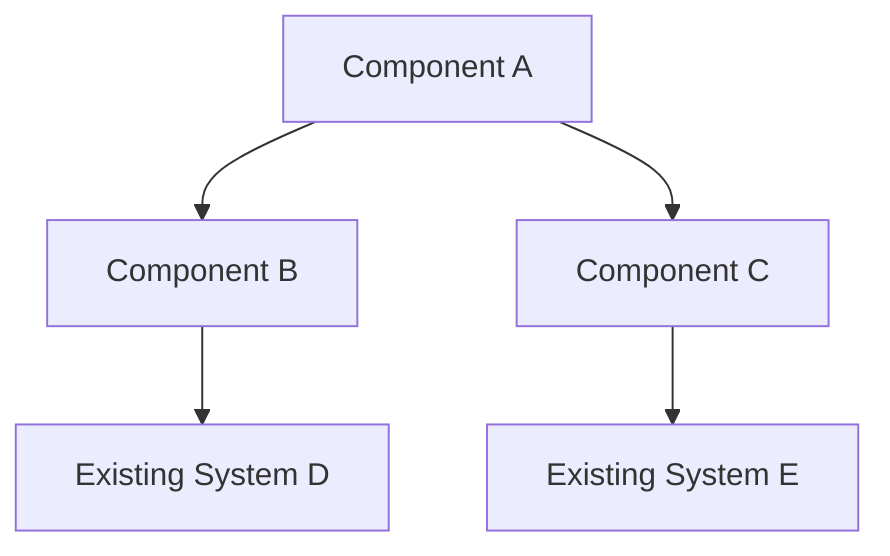
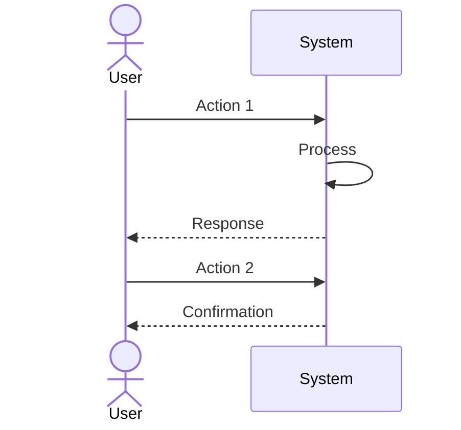
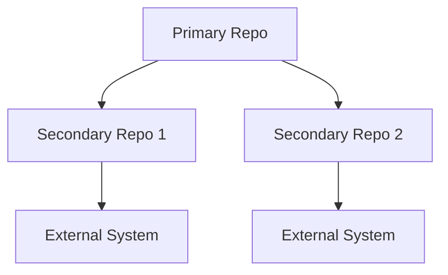

# [Product Name] Requirements Document

> This document outlines the requirements for [Product Name], including problem statement, proposed solution, implementation details, and acceptance criteria.

## Table of Contents

- [1. Problem Statement](#1-problem-statement)
- [2. Proposed Solution](#2-proposed-solution)
- [3. Repository Impact](#3-repository-impact)
- [4. Documentation Impact](#4-documentation-impact)
- [5. Implementation Details](#5-implementation-details)
- [6. Acceptance Criteria](#6-acceptance-criteria)
- [7. Timeline and Milestones](#7-timeline-and-milestones)
- [8. Appendix](#8-appendix)

## 1. Problem Statement

### Clear Problem Definition

_[Provide a concise description of the problem being addressed. What specific pain points or challenges are users/stakeholders experiencing? Why is this a problem worth solving now?]_

### Current Limitations

_[Describe the current state and its limitations. What are the specific constraints, inefficiencies, or gaps in the existing system that need to be addressed?]_

- Limitation 1: _[Description]_
- Limitation 2: _[Description]_
- Limitation 3: _[Description]_

### Success Metrics

_[Define measurable metrics that will indicate the problem has been successfully solved. These should be specific, measurable, and tied to business value.]_

| Metric | Current Value | Target Value | Measurement Method |
|--------|--------------|--------------|-------------------|
| _[Metric 1]_ | _[Current]_ | _[Target]_ | _[How it will be measured]_ |
| _[Metric 2]_ | _[Current]_ | _[Target]_ | _[How it will be measured]_ |
| _[Metric 3]_ | _[Current]_ | _[Target]_ | _[How it will be measured]_ |

## 2. Proposed Solution

### High-Level Approach

_[Outline the high-level approach to solving the problem. What is the overall strategy? Why was this approach chosen over alternatives?]_

### Key Components and Interactions

_[Describe the main components of the solution and how they interact with each other and existing systems.]_

#### Component Descriptions

| Component | Purpose | Key Functionality |
|-----------|---------|------------------|
| Component A | _[Purpose]_ | _[Key functionality]_ |
| Component B | _[Purpose]_ | _[Key functionality]_ |
| Component C | _[Purpose]_ | _[Key functionality]_ |

### User Experience Considerations

_[Describe how users will interact with the solution. What changes will they experience? How will their workflow improve?]_

#### User Workflow

_[Diagram or describe the user workflow with the new solution.]_

#### UI/UX Considerations

_[Describe any UI/UX considerations, including mockups or wireframes if applicable.]_

## 3. Repository Impact

### Primary Repository for Implementation

**Repository**: _[Repository name]_

- **Purpose**: _[Brief description of the repository's purpose]_
- **Key Areas for Changes**:
  - _[Area 1]_: _[Description of changes needed]_
  - _[Area 2]_: _[Description of changes needed]_
  - _[Area 3]_: _[Description of changes needed]_

### Secondary Repositories Requiring Changes

| Repository | Purpose | Required Changes | Impact Level |
|------------|---------|------------------|-------------|
| _[Repo 1]_ | _[Purpose]_ | _[Changes needed]_ | High/Medium/Low |
| _[Repo 2]_ | _[Purpose]_ | _[Changes needed]_ | High/Medium/Low |
| _[Repo 3]_ | _[Purpose]_ | _[Changes needed]_ | High/Medium/Low |

### Integration Points Affected

_[Describe the integration points between repositories that will be affected by the changes. How will data flow between systems change?]_

## 4. Documentation Impact

### Documentation Updates Required

_[List existing documentation that will need to be updated as a result of these changes.]_

| Document | Location | Updates Needed |
|----------|----------|---------------|
| _[Doc 1]_ | _[Location]_ | _[Description of updates]_ |
| _[Doc 2]_ | _[Location]_ | _[Description of updates]_ |
| _[Doc 3]_ | _[Location]_ | _[Description of updates]_ |

### New Documentation Needed

_[Describe new documentation that will need to be created.]_

| Document Type | Purpose | Intended Audience | Recommended Location |
|---------------|---------|-------------------|----------------------|
| _[Type 1]_ | _[Purpose]_ | _[Audience]_ | _[Location]_ |
| _[Type 2]_ | _[Purpose]_ | _[Audience]_ | _[Location]_ |
| _[Type 3]_ | _[Purpose]_ | _[Audience]_ | _[Location]_ |

### Cross-Repository Documentation Concerns

_[Describe any documentation implications that span multiple repositories. How will consistent documentation be maintained?]_

## 5. Implementation Details

### Key Technical Approaches

_[Describe the key technical approaches that will be used to implement the solution. What technologies, patterns, or frameworks will be leveraged?]_

### Major Components to Modify

_[List the major components or modules that will need to be modified or created.]_

| Component | Current State | Planned Modifications | Technical Considerations |
|-----------|---------------|----------------------|--------------------------|
| _[Component 1]_ | _[Current state]_ | _[Planned changes]_ | _[Considerations]_ |
| _[Component 2]_ | _[Current state]_ | _[Planned changes]_ | _[Considerations]_ |
| _[Component 3]_ | _[Current state]_ | _[Planned changes]_ | _[Considerations]_ |

### Potential Migration Considerations

_[Describe any data or system migration considerations. How will the transition from the current state to the future state be handled?]_

| Migration Aspect | Approach | Risks | Mitigation |
|-----------------|----------|-------|------------|
| _[Aspect 1]_ | _[Approach]_ | _[Risks]_ | _[Mitigation]_ |
| _[Aspect 2]_ | _[Approach]_ | _[Risks]_ | _[Mitigation]_ |
| _[Aspect 3]_ | _[Approach]_ | _[Risks]_ | _[Mitigation]_ |

## 6. Acceptance Criteria

### Functional Requirements

_[List the specific functional requirements that must be met for the solution to be considered complete.]_

- [ ] Requirement 1: _[Description]_
- [ ] Requirement 2: _[Description]_
- [ ] Requirement 3: _[Description]_
- [ ] Requirement 4: _[Description]_
- [ ] Requirement 5: _[Description]_

### Non-Functional Requirements

_[List the non-functional requirements such as performance, security, scalability, usability, etc.]_

#### Performance
- [ ] Requirement 1: _[Description with measurable criteria]_
- [ ] Requirement 2: _[Description with measurable criteria]_

#### Security
- [ ] Requirement 1: _[Description with measurable criteria]_
- [ ] Requirement 2: _[Description with measurable criteria]_

#### Scalability
- [ ] Requirement 1: _[Description with measurable criteria]_
- [ ] Requirement 2: _[Description with measurable criteria]_

#### Usability
- [ ] Requirement 1: _[Description with measurable criteria]_
- [ ] Requirement 2: _[Description with measurable criteria]_

### Documentation Deliverables

_[List the specific documentation deliverables that must be completed.]_

- [ ] Deliverable 1: _[Description]_
- [ ] Deliverable 2: _[Description]_
- [ ] Deliverable 3: _[Description]_
- [ ] Deliverable 4: _[Description]_
- [ ] Deliverable 5: _[Description]_

## 7. Timeline and Milestones

_[Outline the high-level timeline and key milestones for implementation.]_

| Milestone | Target Date | Deliverables | Dependencies |
|-----------|-------------|--------------|--------------|
| _[Milestone 1]_ | _[Date]_ | _[Deliverables]_ | _[Dependencies]_ |
| _[Milestone 2]_ | _[Date]_ | _[Deliverables]_ | _[Dependencies]_ |
| _[Milestone 3]_ | _[Date]_ | _[Deliverables]_ | _[Dependencies]_ |
| _[Milestone 4]_ | _[Date]_ | _[Deliverables]_ | _[Dependencies]_ |

## 8. Appendix

### Glossary

_[Define any specialized terms, acronyms, or concepts used in this PRD.]_

| Term | Definition |
|------|------------|
| _[Term 1]_ | _[Definition]_ |
| _[Term 2]_ | _[Definition]_ |
| _[Term 3]_ | _[Definition]_ |

### References

_[List any references, related documents, or resources that are relevant to this PRD.]_

- _[Reference 1]_
- _[Reference 2]_
- _[Reference 3]_

### Decision Records

_[Document key decisions made during the PRD development process, including alternatives considered and rationale for the chosen approach.]_

#### Decision 1: _[Decision Title]_

- **Context**: _[Description of the context and problem]_
- **Options Considered**:
  - Option 1: _[Description]_
  - Option 2: _[Description]_
  - Option 3: _[Description]_
- **Decision**: _[The selected option]_
- **Rationale**: _[Reasons for selecting this option]_
- **Consequences**: _[Positive and negative consequences of this decision]_

---

## Notes for Completing This Template

1. **Problem Statement Section**:
   - Be specific about the problem being solved and why it matters
   - Include measurable metrics that will indicate success
   - Ensure the problem is clearly understood before proposing solutions

2. **Proposed Solution Section**:
   - Focus on the "what" more than the "how"
   - Include diagrams to illustrate components and interactions
   - Consider the user experience impact of the solution

3. **Repository Impact Section**:
   - Identify all repositories affected, not just the primary one
   - Be specific about what changes are needed in each repository
   - Consider integration points between repositories

4. **Documentation Impact Section**:
   - Plan for documentation updates early
   - Consider all types of documentation (user, technical, API, etc.)
   - Think about cross-repository documentation needs

5. **Implementation Details Section**:
   - Include enough technical detail for implementation planning
   - Consider migration paths from the current state
   - Identify potential technical challenges

6. **Acceptance Criteria Section**:
   - Make criteria specific, measurable, and testable
   - Include both functional and non-functional requirements
   - Consider documentation as part of the acceptance criteria

7. **General Guidelines**:
   - Update this document as requirements evolve
   - Get feedback from stakeholders throughout the process
   - Remove this notes section when completing the template