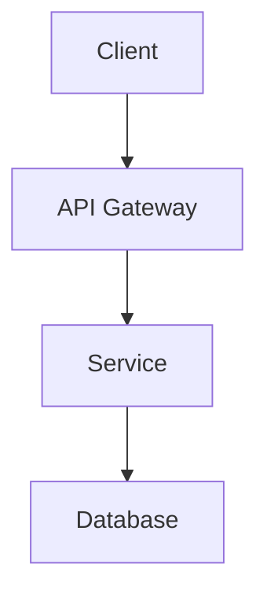

# [Project Name]

[](LICENSE)

> [Brief one-line description of the project]

[More detailed description of the project, including its purpose, main features, and where it fits in the overall ecosystem. Keep this under 200 words.]

## Table of Contents

- [Installation](#installation)
- [Usage](#usage)
- [Architecture](#architecture)
- [API Documentation](#api-documentation)
- [Contributing](#contributing)
- [License](#license)
- [Contact](#contact)

## Installation

### Prerequisites

- [List all prerequisites, e.g., Node.js >= 14, Python >= 3.8, etc.]
- [Include any system dependencies]

### Setup Steps

```bash
# Clone the repository
git clone https://github.com/idynic/[repository-name].git
cd [repository-name]

# Install dependencies
[installation command]

# Configure environment
cp .env.example .env
# Edit .env with your configuration

# Run setup script (if applicable)
[setup command]
```

### Verification

```bash
# Run tests to verify installation
[test command]

# Run smoke test
[smoke test command]
```

## Usage

### Quick Start

```bash
# Start the service
[start command]

# Basic usage example
[example command or code snippet]
```

### Common Operations

#### [Operation 1]

```bash
# Command to perform Operation 1
[command]
```

#### [Operation 2]

```bash
# Command to perform Operation 2
[command]
```

### Configuration Options

| Option | Description | Default | Required |
|--------|-------------|---------|----------|
| `OPTION_1` | [Description] | `default` | Yes/No |
| `OPTION_2` | [Description] | `default` | Yes/No |

## Architecture

### System Overview

[Brief description of the system architecture. Include a diagram if possible.]



### Key Components

- **[Component 1]**: [Description]
- **[Component 2]**: [Description]
- **[Component 3]**: [Description]

### Technology Stack

- **Frontend**: [Technologies]
- **Backend**: [Technologies]
- **Database**: [Technologies]
- **Deployment**: [Technologies]

### Integration Points

- **[Integration 1]**: [Description]
- **[Integration 2]**: [Description]

For detailed architecture information, see [ARCHITECTURE.md](docs/ARCHITECTURE.md).

## API Documentation

[Brief overview of the API, including authentication requirements and format (REST, GraphQL, etc.)]

### Example Endpoints

#### Get [Resource]

```
GET /api/[resource]
```

**Response**

```json
{
  "id": "example-id",
  "name": "Example Name",
  "description": "Example description"
}
```

For complete API documentation, see [API.md](docs/API.md).

## Contributing

We welcome contributions! Please see [CONTRIBUTING.md](CONTRIBUTING.md) for details on how to contribute.

### Development Process

1. Create a branch from `main`
2. Make your changes
3. Submit a pull request
4. Wait for review and approval

## License

This project is licensed under the [MIT License](LICENSE).

## Contact

- **Maintainer**: [Maintainer Name](mailto:maintainer@example.com)
- **Team**: [Team Name](mailto:team@example.com)
- **Issues**: Please use the [issue tracker](https://github.com/idynic/[repository-name]/issues)