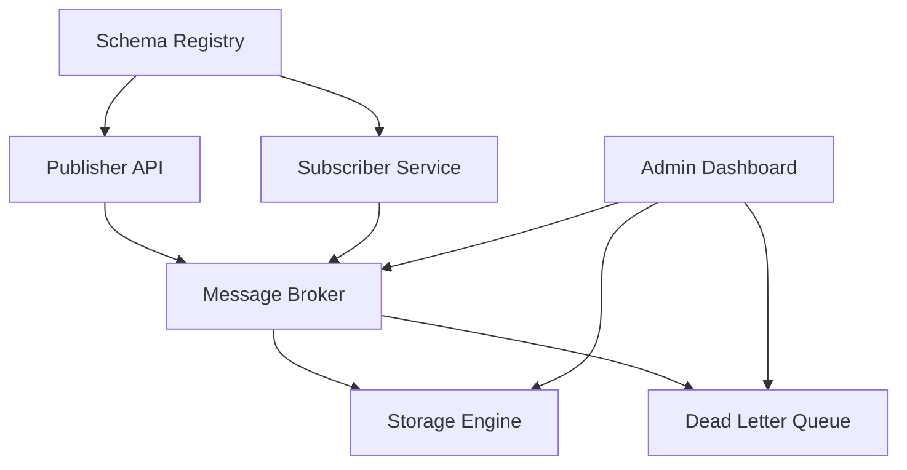
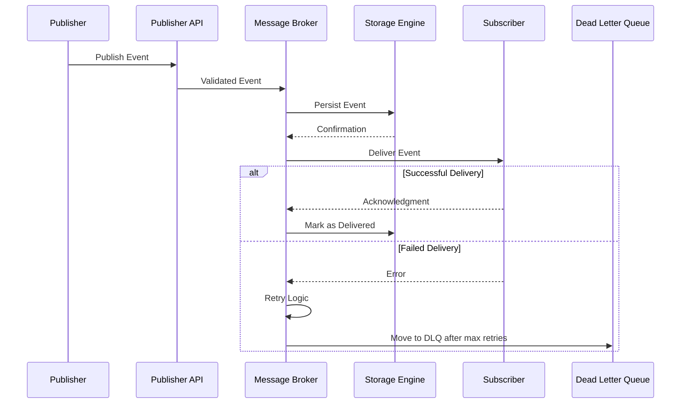
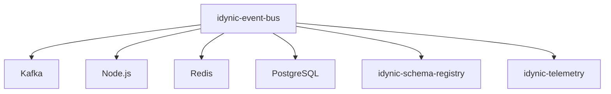
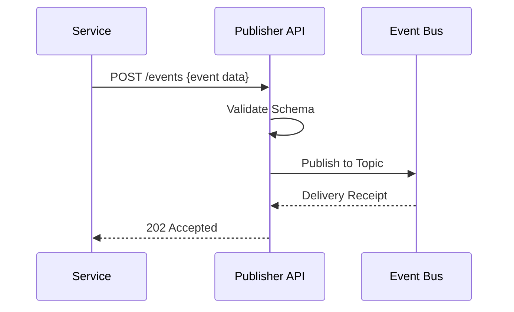
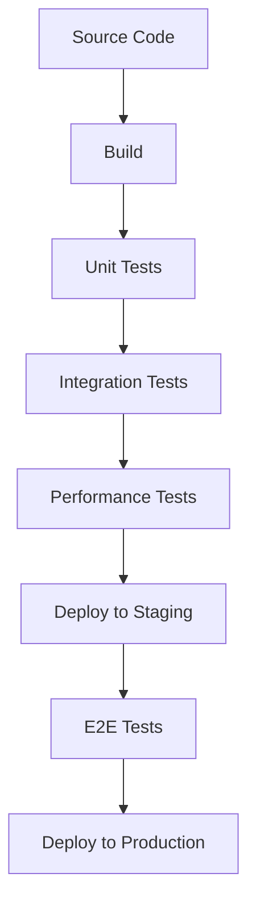

# idynic-event-bus

[](LICENSE)

> **Repository Mission Statement**: _Provide a reliable, scalable event messaging system that enables decoupled communication between Idynic services_

## Table of Contents

- [Purpose](#purpose)
- [Architecture](#architecture)
- [Integration](#integration)
- [Development Guide](#development-guide)
- [Related Repositories](#related-repositories)
- [Maintenance](#maintenance)
- [Contact](#contact)

## Purpose

### Overview

The idynic-event-bus repository implements a centralized event messaging system that enables asynchronous communication between microservices in the Idynic ecosystem. It handles the reliable delivery of events between publishers and subscribers, providing guarantees for message ordering, at-least-once delivery, and dead-letter handling for failed processing attempts.

### Key Problems Solved

- Problem 1: **Service Coupling** - Enables services to communicate without direct dependencies, allowing independent deployment and scaling by implementing a publish-subscribe pattern that decouples event producers from consumers.
- Problem 2: **Message Reliability** - Ensures critical business events are not lost during service outages or network issues by implementing persistent storage with replay capabilities and delivery confirmation.
- Problem 3: **Observability** - Provides visibility into cross-service event flows for debugging and monitoring through comprehensive event logging, tracing, and dashboards that show message flows across the system.

### Primary User Scenarios

#### Scenario 1: Service Developers

Service developers use the event bus to publish domain events from their services and subscribe to events from other services. They define event schemas, register event handlers, and configure routing rules without needing to understand the underlying messaging infrastructure.

```javascript
// Example of a service publishing an event
eventBus.publish('user.created', {
  userId: 'user-123',
  email: 'user@example.com',
  timestamp: new Date().toISOString()
});

// Example of a service subscribing to an event
eventBus.subscribe('user.created', async (event) => {
  await createUserProfile(event.data.userId);
});
```

#### Scenario 2: System Operators

System operators monitor the health of the event bus, configure scaling parameters, and troubleshoot delivery issues. They use the admin dashboard to view event flows, retry failed messages, and configure alerts for abnormal patterns.

### Value Proposition

The event bus is a critical infrastructure component that enables Idynic's microservice architecture to function cohesively while maintaining loose coupling. It provides reliability guarantees that would be complex and time-consuming for individual services to implement, while offering observability tools that help debug cross-service interactions and performance bottlenecks.

## Architecture

### Component Structure

The event bus is composed of several key components that work together to enable reliable event delivery.



### Component Descriptions

#### Publisher API

- **Purpose**: Provides an interface for services to publish events to the bus
- **Responsibilities**:
  - Validate events against schemas
  - Route events to appropriate topics
  - Apply backpressure when system is overloaded
- **Key Files/Locations**:
  - `src/api/publisher.js`
  - `src/validation/schema-validator.js`

#### Message Broker

- **Purpose**: Handles the routing and delivery of messages between publishers and subscribers
- **Responsibilities**:
  - Maintain message queues
  - Track message acknowledgments
  - Implement retry logic for failed deliveries
- **Key Files/Locations**:
  - `src/broker/index.js`
  - `src/broker/delivery-manager.js`

#### Subscriber Service

- **Purpose**: Manages subscription registrations and delivers events to subscribers
- **Responsibilities**:
  - Register and manage subscriptions
  - Track subscriber health
  - Throttle message delivery to unhealthy subscribers
- **Key Files/Locations**:
  - `src/subscribers/manager.js`
  - `src/subscribers/health-monitor.js`

#### Storage Engine

- **Purpose**: Provides durable storage for events to ensure they're not lost
- **Responsibilities**:
  - Persist events to disk
  - Enable event replay for new subscribers
  - Implement retention policies
- **Key Files/Locations**:
  - `src/storage/engine.js`
  - `src/storage/retention-manager.js`

### Data Flow Diagram



### Dependency Diagram



#### Key Dependencies

| Dependency | Version | Purpose | Link |
|------------|---------|---------|------|
| Kafka | 3.5.1 | Underlying message broker | [Apache Kafka](https://kafka.apache.org/) |
| Node.js | 18.x | Runtime environment | [Node.js](https://nodejs.org/) |
| Redis | 7.0.x | Subscription management and caching | [Redis](https://redis.io/) |
| PostgreSQL | 14.x | Event storage and metadata | [PostgreSQL](https://www.postgresql.org/) |
| idynic-schema-registry | 2.x | Event schema validation | [Schema Registry](#) |
| idynic-telemetry | 1.x | Metrics and tracing | [Telemetry](#) |

### Technology Stack

- **Language(s)**: JavaScript/TypeScript
- **Framework(s)**: Node.js, Express.js
- **Database(s)**: PostgreSQL, Redis
- **Infrastructure**: Kubernetes, Kafka, Prometheus

## Integration

### External Interfaces

#### Interface 1: Publisher HTTP API

- **Type**: REST API
- **Purpose**: Allow services to publish events to the event bus
- **Documentation**: [Publisher API Docs](docs/api/publisher.md)
- **Authentication**: Service API keys with JWT



#### Interface 2: Subscriber SDK

- **Type**: Client Library
- **Purpose**: Allow services to subscribe to events from the event bus
- **Documentation**: [Subscriber SDK Docs](docs/sdk/subscriber.md)
- **Authentication**: Service API keys with JWT

### API Contracts

#### API: Publish Event

- **Endpoint**: `/v1/events`
- **Method**: `POST`
- **Request Format**:
  ```json
  {
    "eventType": "user.created",
    "source": "user-service",
    "id": "evt-123456",
    "timestamp": "2023-05-20T13:45:30Z",
    "data": {
      "userId": "usr-789012",
      "email": "user@example.com",
      "name": "John Doe"
    },
    "metadata": {
      "correlationId": "corr-123456"
    }
  }
  ```
- **Response Format**:
  ```json
  {
    "status": "accepted",
    "eventId": "evt-123456",
    "timestamp": "2023-05-20T13:45:31Z",
    "receipt": "rcpt-345678"
  }
  ```
- **Error Handling**:
  ```json
  {
    "status": "error",
    "errorCode": "SCHEMA_VALIDATION_ERROR",
    "message": "Event data does not match schema for event type 'user.created'",
    "details": {
      "field": "data.email",
      "error": "must be a valid email address"
    }
  }
  ```

### Event Patterns

#### Event: user.created

- **Description**: Triggered when a new user is created in the system
- **Source**: user-service
- **Consumers**: notification-service, profile-service, analytics-service
- **Schema**:
  ```json
  {
    "eventType": "user.created",
    "source": "user-service",
    "id": "evt-123456",
    "timestamp": "2023-05-20T13:45:30Z",
    "data": {
      "userId": "usr-789012",
      "email": "user@example.com",
      "name": "John Doe",
      "createdAt": "2023-05-20T13:45:29Z"
    },
    "metadata": {
      "correlationId": "corr-123456"
    }
  }
  ```

#### Event: order.placed

- **Description**: Triggered when a customer places a new order
- **Source**: order-service
- **Consumers**: inventory-service, payment-service, notification-service
- **Schema**:
  ```json
  {
    "eventType": "order.placed",
    "source": "order-service",
    "id": "evt-234567",
    "timestamp": "2023-05-20T14:30:45Z",
    "data": {
      "orderId": "ord-123456",
      "customerId": "cust-789012",
      "items": [
        {
          "productId": "prod-123",
          "quantity": 2,
          "price": 2999
        }
      ],
      "totalAmount": 5998,
      "placedAt": "2023-05-20T14:30:40Z"
    },
    "metadata": {
      "correlationId": "corr-234567"
    }
  }
  ```

## Development Guide

### Setup Instructions

#### Prerequisites

- Node.js v18 or higher
- Docker and Docker Compose
- Kafka CLI tools (optional, for debugging)
- PostgreSQL client (optional, for direct DB access)

#### Installation Steps

```bash
# Clone the repository
git clone https://github.com/idynic/idynic-event-bus.git
cd idynic-event-bus

# Install dependencies
npm install

# Configure environment
cp .env.example .env
# Edit .env with your configuration

# Start required services
docker-compose up -d

# Initialize database
npm run db:migrate

# Run initial setup
npm run setup
```

#### Verification

```bash
# Run tests to verify setup
npm test

# Run smoke test
npm run smoke-test

# Publish a test event
npm run publish-test-event
```

### Common Commands

| Command | Description | Example |
|---------|-------------|---------|
| `npm run dev` | Start the service in development mode | `npm run dev` |
| `npm test` | Run all tests | `npm test` |
| `npm run lint` | Lint the codebase | `npm run lint` |
| `npm run publish` | Publish an event from command line | `npm run publish user.created '{"userId":"123"}'` |
| `npm run monitor` | Start the monitoring dashboard | `npm run monitor` |

### Testing Approach

#### Test Structure

The repository uses a layered testing approach to ensure reliability.

```
/tests
├── unit/              # Unit tests for individual components
├── integration/       # Tests for component interactions
├── performance/       # Load and performance tests
└── e2e/               # End-to-end system tests
```

#### Running Tests

```bash
# Run all tests
npm test

# Run unit tests
npm run test:unit

# Run integration tests
npm run test:integration

# Run e2e tests
npm run test:e2e

# Run performance tests
npm run test:performance
```

#### Writing Tests

When writing tests, follow these guidelines:

- Unit tests should mock external dependencies
- Integration tests should use test containers
- End-to-end tests should use the real infrastructure

```javascript
// Example unit test
test('should validate event schema', async () => {
  const validator = new SchemaValidator();
  const event = {
    eventType: 'user.created',
    data: { userId: '123' }
  };
  
  const result = await validator.validate(event);
  
  expect(result.valid).toBe(true);
});
```

### CI/CD Pipeline

The event bus uses a comprehensive CI/CD pipeline to ensure quality and reliability.



## Related Repositories

| Repository | Description | Link |
|------------|-------------|------|
| idynic-schema-registry | Centralized registry for event schemas | [Link](#) |
| idynic-telemetry | Common telemetry and monitoring tools | [Link](#) |
| idynic-service-template | Template for services that use the event bus | [Link](#) |

## Maintenance

### Release Process

The event bus follows semantic versioning (MAJOR.MINOR.PATCH) with the following release cadence:

- **Patch releases**: Weekly, for bug fixes and minor improvements
- **Minor releases**: Monthly, for new features that are backward compatible
- **Major releases**: Quarterly, for breaking changes

All changes are documented in CHANGELOG.md, and migration guides are provided for major releases.

### Monitoring and Alerting

| Metric | Description | Alert Threshold | Remediation |
|--------|-------------|-----------------|------------|
| `event_delivery_success_rate` | Percentage of events delivered successfully | < 99.9% | Check subscriber health, message broker status |
| `event_processing_time` | Time to process an event from publish to delivery | > 500ms | Investigate subscriber performance, check broker load |
| `queue_depth` | Number of messages waiting to be processed | > 10,000 | Scale up consumers, check for slow subscribers |
| `dead_letter_queue_size` | Number of messages in the DLQ | > 100 | Investigate message failures, fix consumer issues |

### Troubleshooting

#### Issue: High Event Delivery Latency

- **Symptoms**: Events take longer than expected to be delivered to subscribers
- **Possible Causes**:
  - High system load
  - Network congestion
  - Slow subscribers causing backpressure
- **Resolution Steps**:
  1. Check system metrics for CPU/memory pressure
  2. Verify subscriber health metrics
  3. Investigate network performance between components
  4. Scale up resources if needed

#### Issue: Events Not Being Delivered

- **Symptoms**: Subscribers report missing events, or events appear in the dead letter queue
- **Possible Causes**:
  - Schema validation failures
  - Subscriber exceptions during processing
  - Connection issues between components
- **Resolution Steps**:
  1. Check the dead letter queue for failed events
  2. Verify event schema compliance
  3. Check subscriber logs for processing errors
  4. Ensure all services can connect to the message broker

## Contact

- **Team**: Event Infrastructure Team
- **Primary Contact**: Jane Smith, Event Infrastructure Lead
- **Slack Channel**: #event-bus-support
- **Documentation**: [Comprehensive Documentation](https://docs.idynic.com/event-bus)