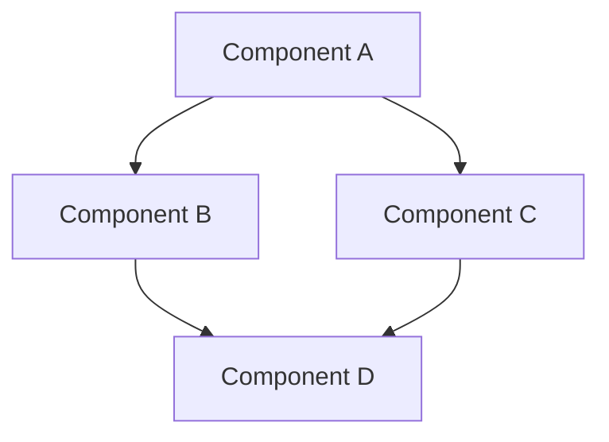
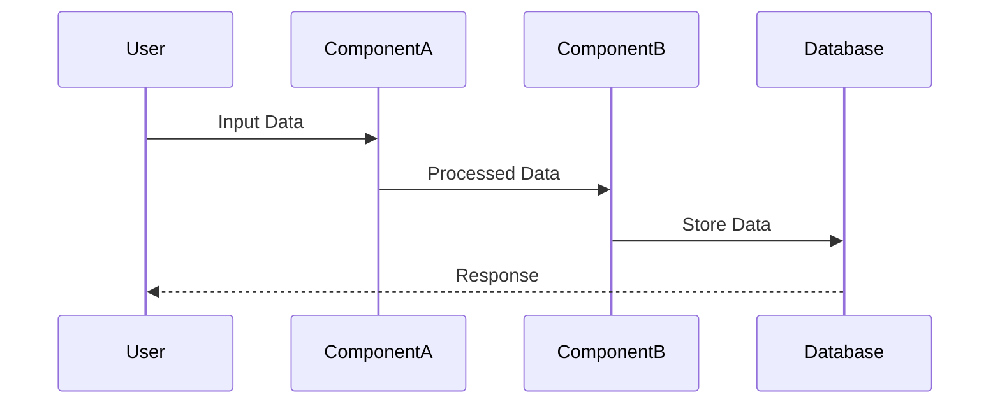
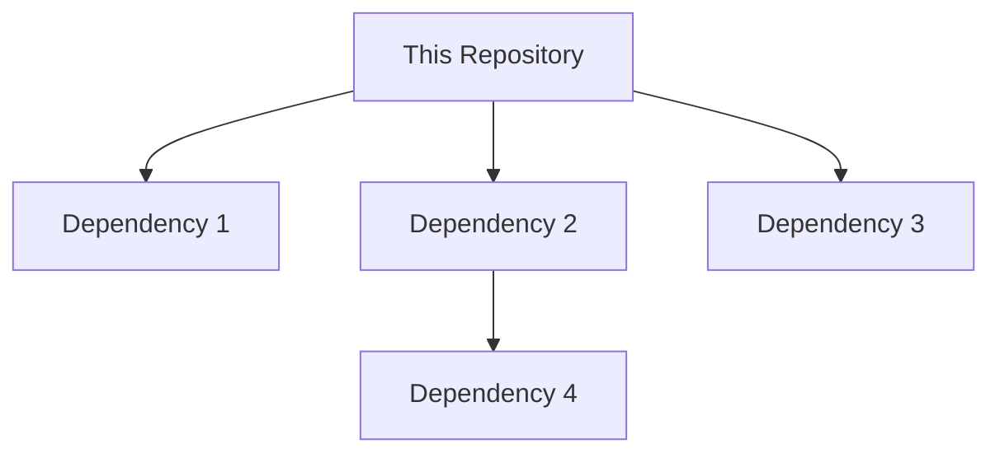
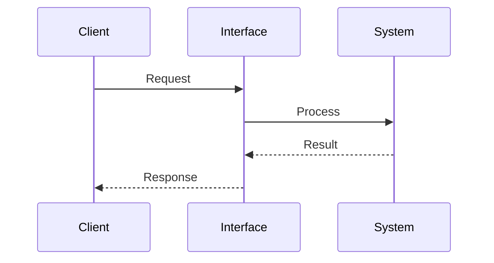
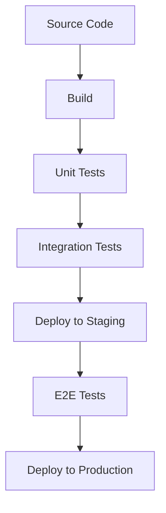

# [Repository Name]

[](LICENSE)

> **Repository Mission Statement**: _[Concise statement about the repository's purpose and value proposition]_

## Table of Contents

- [Purpose](#purpose)
- [Architecture](#architecture)
- [Integration](#integration)
- [Development Guide](#development-guide)
- [Related Repositories](#related-repositories)
- [Maintenance](#maintenance)
- [Contact](#contact)

## Purpose

### Overview

_[Provide a clear, concise description of what this repository is for, what problem it solves, and why it exists. 3-5 sentences that explain the repository's purpose to someone unfamiliar with it.]_

### Key Problems Solved

_[List the specific problems this repository helps solve. Be concrete about the challenges it addresses.]_

- Problem 1: _[Description of problem and how this repository solves it]_
- Problem 2: _[Description of problem and how this repository solves it]_
- Problem 3: _[Description of problem and how this repository solves it]_

### Primary User Scenarios

_[Describe the main use cases and the types of users who benefit from this repository. Focus on real-world scenarios that the code enables.]_

#### Scenario 1: [User Type/Role]

_[Describe how this type of user interacts with the repository's output/service]_

#### Scenario 2: [User Type/Role]

_[Describe how this type of user interacts with the repository's output/service]_

### Value Proposition

_[Clearly articulate the unique value this repository brings to the organization. Why is it important? What makes it special?]_

## Architecture

### Component Structure

_[Describe the high-level architecture of the repository, including major components and their responsibilities.]_



### Component Descriptions

#### [Component A]

- **Purpose**: _[Brief description of what this component does]_
- **Responsibilities**:
  - _[Key responsibility 1]_
  - _[Key responsibility 2]_
- **Key Files/Locations**:
  - _[Path to key file/directory]_
  - _[Path to key file/directory]_

#### [Component B]

- **Purpose**: _[Brief description of what this component does]_
- **Responsibilities**:
  - _[Key responsibility 1]_
  - _[Key responsibility 2]_
- **Key Files/Locations**:
  - _[Path to key file/directory]_
  - _[Path to key file/directory]_

### Data Flow Diagram

_[Illustrate how data flows through the system, showing inputs, processing steps, and outputs.]_



### Dependency Diagram

_[Show external dependencies and their relationships to the repository components.]_



#### Key Dependencies

| Dependency | Version | Purpose | Link |
|------------|---------|---------|------|
| Dependency 1 | x.y.z | Purpose of this dependency | [Link](#) |
| Dependency 2 | x.y.z | Purpose of this dependency | [Link](#) |
| Dependency 3 | x.y.z | Purpose of this dependency | [Link](#) |

### Technology Stack

_[List the key technologies used in this repository and briefly explain why they were chosen.]_

- **Language(s)**: _[Programming languages used]_
- **Framework(s)**: _[Frameworks used]_
- **Database(s)**: _[Databases used]_
- **Infrastructure**: _[Infrastructure technologies]_

## Integration

### External Interfaces

_[Document the external interfaces that interact with this repository, such as APIs, message queues, or file systems.]_

#### Interface 1: [Name]

- **Type**: _[REST API, GraphQL, Event Stream, etc.]_
- **Purpose**: _[Description of what this interface is used for]_
- **Documentation**: _[Link to detailed documentation]_
- **Authentication**: _[Authentication requirements]_



#### Interface 2: [Name]

- **Type**: _[REST API, GraphQL, Event Stream, etc.]_
- **Purpose**: _[Description of what this interface is used for]_
- **Documentation**: _[Link to detailed documentation]_
- **Authentication**: _[Authentication requirements]_

### API Contracts

_[Document the API contracts for services provided by this repository.]_

#### API: [Name]

- **Endpoint**: `[Endpoint path]`
- **Method**: `[HTTP Method]`
- **Request Format**:
  ```json
  {
    "field1": "value1",
    "field2": "value2"
  }
  ```
- **Response Format**:
  ```json
  {
    "result": "success",
    "data": {
      "field1": "value1",
      "field2": "value2"
    }
  }
  ```
- **Error Handling**:
  ```json
  {
    "result": "error",
    "error": {
      "code": "ERROR_CODE",
      "message": "Error message"
    }
  }
  ```

### Event Patterns

_[Document the event patterns used by this repository, such as publish/subscribe mechanisms, event-driven architecture, or webhooks.]_

#### Event: [Event Name]

- **Description**: _[Description of the event]_
- **Source**: _[Where the event originates]_
- **Consumers**: _[Systems that consume this event]_
- **Schema**:
  ```json
  {
    "event": "EVENT_NAME",
    "timestamp": "ISO-8601 timestamp",
    "data": {
      "field1": "value1",
      "field2": "value2"
    }
  }
  ```

## Development Guide

### Setup Instructions

_[Provide step-by-step instructions for setting up a development environment for this repository.]_

#### Prerequisites

- _[Prerequisite 1]_
- _[Prerequisite 2]_
- _[Prerequisite 3]_

#### Installation Steps

```bash
# Clone the repository
git clone https://github.com/idynic/[repository-name].git
cd [repository-name]

# Install dependencies
[command to install dependencies]

# Configure environment
cp .env.example .env
# Edit .env with your configuration

# Setup database (if applicable)
[database setup commands]

# Run initial setup
[setup commands]
```

#### Verification

```bash
# Run tests to verify setup
[test command]

# Run smoke test
[smoke test command]
```

### Common Commands

_[List and explain common commands used during development.]_

| Command | Description | Example |
|---------|-------------|---------|
| `[command]` | [Command description] | `[example]` |
| `[command]` | [Command description] | `[example]` |
| `[command]` | [Command description] | `[example]` |

### Testing Approach

_[Describe the testing strategy for this repository, including unit tests, integration tests, and end-to-end tests.]_

#### Test Structure

_[Explain the organization of tests in the repository.]_

```
/tests
├── unit/
├── integration/
└── e2e/
```

#### Running Tests

```bash
# Run all tests
[test command]

# Run unit tests
[unit test command]

# Run integration tests
[integration test command]

# Run e2e tests
[e2e test command]
```

#### Writing Tests

_[Provide guidelines for writing tests for this repository.]_

```
[Example test code]
```

### CI/CD Pipeline

_[Describe the CI/CD pipeline for this repository, including build, test, and deployment steps.]_



## Related Repositories

_[List and describe related repositories that developers should be aware of.]_

| Repository | Description | Link |
|------------|-------------|------|
| [Repository Name] | [Brief description] | [Link](#) |
| [Repository Name] | [Brief description] | [Link](#) |
| [Repository Name] | [Brief description] | [Link](#) |

## Maintenance

### Release Process

_[Describe the release process for this repository, including versioning strategy, release cadence, and changelog management.]_

### Monitoring and Alerting

_[Describe how the services from this repository are monitored in production, including key metrics and alerting thresholds.]_

| Metric | Description | Alert Threshold | Remediation |
|--------|-------------|-----------------|------------|
| [Metric] | [Description] | [Threshold] | [Remediation steps] |
| [Metric] | [Description] | [Threshold] | [Remediation steps] |

### Troubleshooting

_[Provide guidance for troubleshooting common issues with services from this repository.]_

#### Issue: [Common Issue]

- **Symptoms**: _[How to identify this issue]_
- **Possible Causes**: _[What might cause this issue]_
- **Resolution Steps**: _[Steps to resolve the issue]_

## Contact

_[Provide contact information for the team responsible for this repository.]_

- **Team**: _[Team name]_
- **Primary Contact**: _[Name or role]_
- **Slack Channel**: _[Slack channel]_
- **Documentation**: _[Link to additional documentation]_

---

## Notes for Completing This Template

1. **Purpose Section**:
   - The mission statement should clearly articulate why this repository exists
   - Focus on concrete problems solved rather than abstract descriptions
   - Include real user scenarios that demonstrate the value

2. **Architecture Section**:
   - Use diagrams to illustrate complex relationships
   - Be specific about component responsibilities
   - Ensure dependency versions are kept up to date

3. **Integration Section**:
   - Provide enough detail for other teams to integrate without extensive questions
   - Include authentication requirements
   - Keep API contracts and event schemas up to date

4. **Development Guide**:
   - Test setup instructions with a fresh environment
   - Include troubleshooting for common setup issues
   - Keep command examples current with latest tooling

5. **General Guidelines**:
   - Update this documentation when making significant changes
   - Remove this notes section when completing the template
   - Link to more detailed documentation where appropriate
   - Keep examples current and functional