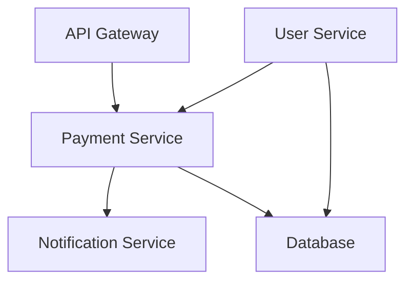
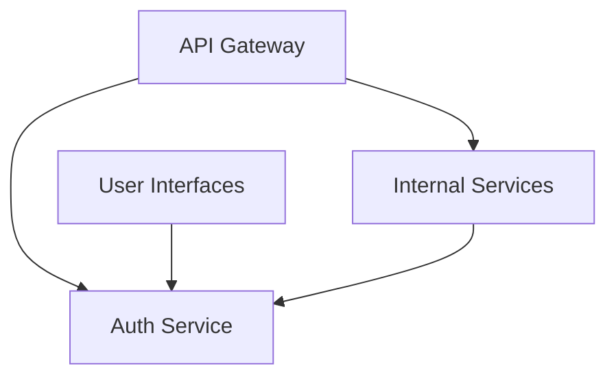
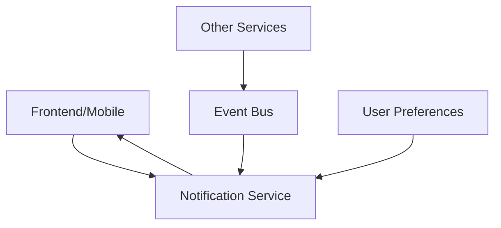

# Guidelines for Completing the Repository Impact Section

This document provides guidance on completing the Repository Impact section in the Product Requirements Document (PRD) template. A thorough repository impact assessment is critical for understanding the scope of changes, identifying potential integration issues, and planning development work across teams.

## Purpose of the Repository Impact Section

The Repository Impact section serves several important purposes:

1. **Cross-Team Coordination**: Clearly identifies which repositories (and thus which teams) will be affected by the proposed changes.
2. **Implementation Planning**: Helps development teams understand the scope of changes required in each repository.
3. **Integration Risk Assessment**: Identifies integration points that may be affected, which are often sources of bugs or performance issues.
4. **Resource Allocation**: Assists in allocating development resources based on the extent of changes required.
5. **Dependency Management**: Ensures that dependencies between repositories are properly managed during implementation.

## How to Complete the Repository Impact Section

### 1. Primary Repository for Implementation

This subsection should identify the main repository where most of the implementation work will occur.

#### Guidelines:

- **Be Specific**: Name the exact repository (e.g., `idynic-user-service` rather than just "user service").
- **State Purpose**: Briefly describe the purpose of the repository to provide context.
- **Key Areas for Changes**: 
  - List the specific directories, modules, or components within the repository that will require changes.
  - For each area, describe the nature of the changes (e.g., "Add new API endpoints for user preferences").
  - Estimate the scope of changes (e.g., "Extensive changes to authentication module" vs. "Minor updates to logging configuration").

#### Example:

```markdown
**Repository**: `idynic-payment-service`

- **Purpose**: Handles all payment processing and transaction management
- **Key Areas for Changes**:
  - `src/api/controllers`: Add new controller for subscription management
  - `src/services/billing`: Extend billing service with subscription logic
  - `src/models`: Add new data models for subscription plans and billing cycles
  - `tests/integration`: Add comprehensive tests for subscription workflows
```

### 2. Secondary Repositories Requiring Changes

This subsection should identify all other repositories that will require changes to support the implementation.

#### Guidelines:

- **Be Comprehensive**: Include all repositories that will need any changes, no matter how small.
- **Include Dependency Version Updates**: List repositories that will only need dependency version updates.
- **Prioritize by Impact**: Use the Impact Level field to indicate the extent of changes required (High/Medium/Low).
- **Link to Primary Repository**: Explain how changes in each secondary repository relate to the primary implementation.

#### Example:

```markdown
| Repository | Purpose | Required Changes | Impact Level |
|------------|---------|------------------|-------------|
| `idynic-api-gateway` | Routes API requests to appropriate services | Add routes for new subscription endpoints | Low |
| `idynic-user-service` | Manages user accounts and profiles | Add user-subscription association logic | Medium |
| `idynic-notification-service` | Handles user notifications | Add templates and triggers for subscription events | Medium |
| `idynic-frontend` | Web user interface | Add subscription management UI components | High |
| `idynic-docs` | Public API documentation | Document new subscription API endpoints | Low |
```

### 3. Integration Points Affected

This subsection should identify and describe how changes will affect the integration points between repositories.

#### Guidelines:

- **Focus on Interfaces**: Pay special attention to APIs, events, shared databases, or other interfaces between systems.
- **Data Flow Changes**: Describe how data will flow differently between systems after implementation.
- **Versioning Concerns**: Note any API or event schema versioning issues that need to be addressed.
- **Backward Compatibility**: Identify any backward compatibility requirements for integration points.
- **Use Diagrams**: Include a diagram showing the affected repositories and their integration points.

#### Example:

```markdown
The subscription management feature will affect several integration points:

1. **User Service → Payment Service**: The user service will need to call new API endpoints in the payment service to associate users with subscription plans.

2. **Payment Service → Notification Service**: New events will be emitted when subscription status changes (created, renewed, canceled, etc.) that the notification service will consume.

3. **API Gateway → Payment Service**: New routes will be added to the API gateway to expose subscription management endpoints.

4. **Data Consistency**: The user and payment services will need to maintain consistent data about user subscription status, requiring transaction management across services.


```

## Common Pitfalls and How to Avoid Them

### 1. Overlooking Indirect Dependencies

**Problem**: Failing to identify repositories that don't directly interact with the primary repository but are still affected by the changes.

**Solution**: 
- Draw a complete system diagram showing all connections between repositories.
- Trace data flows and API calls to identify indirect dependencies.
- Consider second-order effects (e.g., changes in data formats that propagate through the system).

### 2. Underestimating Integration Impact

**Problem**: Assuming that changes to integration points are simpler than they actually are.

**Solution**:
- Carefully examine contract changes (API signatures, event schemas, data formats).
- Consider versioning needs for APIs and events.
- Identify changes that require coordinated deployment across multiple repositories.

### 3. Insufficient Detail on Changes

**Problem**: Being too vague about what changes are required in each repository.

**Solution**:
- Specify the files, components, or modules that will change when possible.
- Describe the nature of changes (add, modify, remove).
- Provide examples of changes when complexity is high.

### 4. Missing Deployment Considerations

**Problem**: Focusing only on code changes while ignoring deployment dependencies.

**Solution**:
- Include CI/CD pipeline changes in your impact assessment.
- Consider deployment ordering requirements (e.g., API must be deployed before clients).
- Note any database migration scripts or data transformation needs.

### 5. Forgetting Configuration and Infrastructure

**Problem**: Overlooking changes to configuration files or infrastructure as code.

**Solution**:
- Include configuration repositories in your assessment.
- Note changes to environment variables, feature flags, or service configurations.
- Include infrastructure code (Terraform, CloudFormation, etc.) when relevant.

## Techniques for Comprehensive Repository Impact Analysis

### 1. Codebase Exploration

- **Grep for Dependencies**: Use code search tools to find all references to affected components.
- **API Usage Analysis**: Trace API calls to identify all consumers of changing interfaces.
- **Event Flow Mapping**: Map event producers and consumers to understand the full impact of event changes.

### 2. Architecture Review

- **Review Architecture Diagrams**: Compare the proposed changes against current architecture diagrams.
- **Service Responsibility Analysis**: Review service boundaries to ensure changes align with service responsibilities.
- **Data Ownership Review**: Check if changes affect data ownership or consistency requirements.

### 3. Team Collaboration

- **Cross-Team Reviews**: Have the PRD reviewed by representatives from all potentially affected teams.
- **Architecture Council Review**: Present significant changes to the architecture council or technical leadership.
- **Domain Expert Consultation**: Consult with domain experts to identify non-obvious impacts.

## Examples of Well-Documented Repository Impact Sections

### Example 1: API Change with Widespread Impact

```markdown
## 3. Repository Impact

### Primary Repository for Implementation

**Repository**: `idynic-auth-service`

- **Purpose**: Handles authentication and authorization for all Idynic services
- **Key Areas for Changes**:
  - `src/api/controllers/oauth`: Implement OAuth 2.1 protocol updates
  - `src/services/token`: Update token issuance and validation logic
  - `src/models/session`: Enhance session management for new security requirements
  - `config/security`: Update security configuration for new protocols

### Secondary Repositories Requiring Changes

| Repository | Purpose | Required Changes | Impact Level |
|------------|---------|------------------|-------------|
| `idynic-api-gateway` | Routes API requests | Update authentication middleware to validate new token format | High |
| `idynic-user-service` | Manages user accounts | Update client libraries for new auth endpoints | Medium |
| `idynic-admin-portal` | Admin interface | Update login flow and session management | Medium |
| `idynic-customer-portal` | Customer interface | Update login flow and session management | Medium |
| `idynic-mobile-app` | Mobile application | Update OAuth client implementation | High |
| `idynic-service-template` | Template for services | Update auth client library and examples | Low |
| `idynic-infrastructure` | Infrastructure as code | Update security group rules for new endpoints | Low |

### Integration Points Affected

The authentication changes will affect all services that require authenticated requests:

1. **Token Validation**: All services will need to update how they validate tokens, requiring coordinated deployment.

2. **Login Flows**: All user interfaces will need to update their login flows to support the new OAuth implementation.

3. **Session Management**: Services that maintain session state will need to adapt to new session token formats.

4. **API Gateway**: Authentication middleware in the API gateway will need to be updated to recognize and validate new token formats.

5. **Service-to-Service Communication**: Internal service communication using service accounts will need to be updated.


```

### Example 2: New Feature with Focused Impact

```markdown
## 3. Repository Impact

### Primary Repository for Implementation

**Repository**: `idynic-notification-service`

- **Purpose**: Manages user notifications across email, SMS, and push channels
- **Key Areas for Changes**:
  - `src/channels`: Add new in-app notification channel
  - `src/api/controllers`: Add endpoints for reading/managing in-app notifications
  - `src/models`: Create data models for storing in-app notifications
  - `src/services/delivery`: Implement delivery logic for in-app notifications

### Secondary Repositories Requiring Changes

| Repository | Purpose | Required Changes | Impact Level |
|------------|---------|------------------|-------------|
| `idynic-frontend` | Web user interface | Add notification center UI component | Medium |
| `idynic-mobile-app` | Mobile application | Add notification handling and UI | Medium |
| `idynic-user-preferences` | User preference management | Add settings for in-app notification preferences | Low |
| `idynic-event-schemas` | Event definitions | Add new notification event schemas | Low |

### Integration Points Affected

The in-app notification feature primarily affects the interfaces between the notification service and user interfaces:

1. **Notification Service → Frontend/Mobile**: New API endpoints will be exposed for the UI to fetch and manage notifications.

2. **Event Publishing**: Services that publish notification events won't need changes as the existing event schema will be extended rather than modified.

3. **Notification Preferences**: The user preferences service will need to store additional preferences for in-app notifications.

4. **Real-time Updates**: A WebSocket connection will be added between the notification service and frontend/mobile apps for real-time notification delivery.


```

## Conclusion

A well-documented Repository Impact section is essential for successful implementation planning and cross-team coordination. By following these guidelines, you'll help ensure that all affected repositories are identified, changes are properly scoped, and integration points are carefully considered. This comprehensive approach reduces implementation risks and enables more accurate resource planning and scheduling.